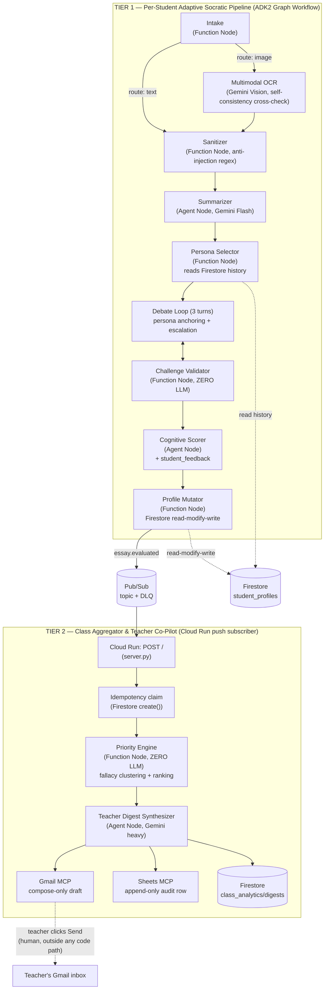

# eduagent — Collaborative Partner Socratic Mentor

> All Things Agentic Hackathon — Track: **Collaborative Partner**
> Philosophy: *using AI to teach students not to depend on AI.*

`eduagent` is a two-tier agentic system built on **Google ADK2 + Gemini (Vertex AI) + Firestore + Pub/Sub + Cloud Run**:

- **Tier 1 (per-student):** a student submits an essay (typed text, or a photo of a handwritten one) and gets challenged by an adversarial Socratic debate persona instead of being handed answers or corrections. The system remembers the student's persistent weaknesses across essays and adapts.
- **Tier 2 (class-wide):** every graded essay triggers an event-driven Class Aggregator that clusters shared logical fallacies across a class, ranks which students need attention first (deterministically, not by LLM vibes), and drafts a digest for the teacher — who is the only one who can actually send it.

---

## 1. Mandatory disclosure

This architecture is inspired by the author's personal prior project, **CritiqAI** (entered in a different, earlier competition). **All code in this repository was written from scratch during this hackathon's Submission Period.** No source file, prompt, or data schema was copied from that prior project — it was used only as a case study for lessons learned (see `PROJECT_WIKI.md` section 9). Track: **Collaborative Partner**.

---

## 2. Architecture



**Data flow in one sentence:** an essay (text or photo) goes through a deterministic-first ADK2 graph that debates, scores, and mutates a per-student Firestore profile; every graded essay fires a Pub/Sub event that a separate Cloud Run service picks up to compute a class-wide priority ranking and draft a teacher digest — with exactly one human-in-the-loop gate (the teacher pressing Send in their own Gmail).

### Repo layout

```
src/eduagent/
  nodes/          Tier 1 graph nodes (intake, ocr, summarizer, persona_selector, debate, validator, scorer, mutator)
  skills/         personas.py, debate_escalation.py, language.py — reusable logic, not graph nodes
  memory/         student_profile.py (pure merge logic) + firestore_memory.py (Firestore wrapper)
  aggregator/     Tier 2: priority_engine.py (zero-LLM ranking), digest.py, digest_store.py, idempotency.py, class_aggregator.py
  integrations/   gmail_mcp.py (compose-only), sheets_mcp.py (append-only)
  graph/          tier1_pipeline.py — the ADK2 Workflow wiring
  server.py       Cloud Run entrypoint (Tier 2 Pub/Sub push subscriber)
  llm.py          thin Vertex AI wrapper (text/JSON/multimodal, retry + degrade)
  resilience.py   shared retry policy for Firestore/Pub/Sub/Gmail/Sheets
  interactive.py  turn-by-turn debate helper for a future Web UI/API
scripts/          one-off verification, demo, seed, deploy-adjacent, and diagnostic scripts (see PROJECT_WIKI.md / TODO.md for what each does)
eval/             ADK Eval Suite (evalset.py, results/) + eval/test_images/ (real handwritten essay photos)
tests/            pytest suite — fast unit tests by default, `@pytest.mark.e2e` for the one real-Vertex-AI test
```

---

## 3. Spin-up instructions (from a clean machine)

### 3.1 Prerequisites

- Python 3.11+ (developed against 3.14)
- A GCP project with these APIs enabled: `aiplatform`, `firestore`, `run`, `pubsub`, `cloudtrace`, `logging`, `gmail.googleapis.com`
- A Firestore database (Native mode) in that project
- `gcloud` CLI authenticated, or a service-account key with the roles listed in section 5 below
- (Optional, for Tier 2 delivery channels) a Gmail OAuth Desktop client + a Google Sheet

### 3.2 Install

```bash
git clone <this-repo-url>
cd CritiqAI_ver2
python -m venv .venv && source .venv/bin/activate   # or .venv\Scripts\activate on Windows
pip install -r requirements.txt
cp .env.example .env   # then fill in GCP_PROJECT_ID and the other values
```

`GOOGLE_APPLICATION_CREDENTIALS` in `.env` should point at a service-account key with the roles in section 5 — or omit it entirely and use `gcloud auth application-default login` for local dev.

### 3.3 Verify GCP connectivity before touching the pipeline

```bash
python scripts/doctor.py
```

This checks GCP ADC, Firestore, Pub/Sub topic/DLQ/subscription, the Gmail OAuth token, the Sheets audit spreadsheet, and Vertex AI reachability in one shot — exactly what you want to run before a live demo recording, and the fastest way to find out what's missing on a fresh machine.

### 3.4 Run the fast test suite (no live GCP calls)

```bash
pytest tests/ -q -m "not e2e"
```

Add `-m e2e` (or drop the marker filter) to also run the one test that hits real Vertex AI (`tests/test_tier1_skeleton.py`).

### 3.5 Run Tier 1 for real (text)

```bash
python scripts/demo_tier1_run.py
```

Runs 3 essays for the same (freshly created) student through the real graph against real Vertex AI + Firestore, and prints how persona choice and `score_trend` evolve across essays — the direct evidence for "becomes more helpful over time."

### 3.6 Run Tier 1 with a real handwritten photo (Multimodal OCR)

```bash
python scripts/demo_ocr_run.py                    # 3 real photos -> full pipeline
python scripts/demo_real_handwriting_ocr.py        # OCR node only, all 12 sample photos in eval/test_images/
```

### 3.7 Seed sample class data + run Tier 2 locally

```bash
python scripts/seed_student_profiles.py                       # 5 sample student_profiles documents
python scripts/run_class_aggregator_subscriber.py --once       # pulls essay.evaluated events, runs process_event()
```

### 3.8 Run the ADK Eval Suite

```bash
python scripts/run_eval_suite.py
```

Writes `eval/results/eval_report.{json,md}` — see section 6 for the last committed results.

### 3.9 Run the Cloud Run service locally

```bash
PYTHONPATH=src uvicorn eduagent.server:app --host 0.0.0.0 --port 8080
curl localhost:8080/health-check   # -> {"status": "ok"}
```

### 3.10 Deploy to Cloud Run

```bash
gcloud run deploy eduagent-class-aggregator \
  --source . \
  --region <your-region> \
  --service-account eduagent-sa@<project>.iam.gserviceaccount.com \
  --no-allow-unauthenticated \
  --set-env-vars GCP_PROJECT_ID=<project>,GOOGLE_GENAI_USE_VERTEXAI=True

# Then point the class-aggregator-sub subscription at the deployed URL as a
# push subscription with OIDC auth (see Pub/Sub push docs) instead of pulling.
```

`--no-allow-unauthenticated` plus Pub/Sub's own service-agent OIDC token is what keeps this endpoint from being a public, unauthenticated trigger for essay-grading side effects — do not deploy with `--allow-unauthenticated` for anything beyond a throwaway smoke test.

**Live deployment (this project):** `https://eduagent-class-aggregator-s6pcepa2cq-as.a.run.app` (region `asia-southeast1`, same region as Firestore). Verified against the real service:

```bash
TOKEN=$(gcloud auth print-identity-token)
curl -H "Authorization: Bearer $TOKEN" https://eduagent-class-aggregator-s6pcepa2cq-as.a.run.app/health-check
# -> {"status":"ok"}
```

See ADR-011 for a real deploy-time finding: the endpoint is `/health-check`, not the more conventional `/healthz`.

---

## 4. Architecture Decision Records

| # | Decision | Reason | Rejected alternative |
|---|---|---|---|
| ADR-001 | Gmail least-privilege is enforced at the **code layer** (never call `.send()`), not the OAuth scope layer. A hard AST-based test (`tests/test_gmail_mcp_never_sends.py`) gates this. | Real testing (2026-08-24) proved `gmail.compose` does **not** block `messages.send()` — Google's own docs describe it as including send. No Gmail scope exists that permits draft creation but blocks send at the credential layer. | Assuming OAuth scope alone would provide the HITL guarantee (the original plan) — proven false by live testing before it could surface in a demo or judge Q&A. |
| ADR-002 | Use `gemini-3.5-flash` (default) and `gemini-3.7-flash` (`heavy_model`) instead of `gemini-3.5-pro`. | `gemini-3.5-pro` does not exist as a publisher model in this project/region (verified via `client.models.list()`) — only the Flash lineage (3.5/3.6/3.7) is available. `heavy_model` still satisfies "Gemini 3.5 or newer" since 3.7 > 3.5. | Blocking on a Pro-tier model that isn't actually available in this environment. |
| ADR-003 | Pub/Sub `max_delivery_attempts = 5` (not 3). | Google Pub/Sub enforces a platform floor of 5 for dead-letter policies — a subscription create with 3 was rejected outright. This is a platform constraint, not a design choice. | Sticking to the original plan's "3 tries then DLQ" framing, which isn't achievable on this platform. |
| ADR-004 | Bilingual (VI/EN) output applies only to the **expression layer** (debate questions, `student_feedback`), never to `summarizer.fallacies_draft`. | `persona_selector` matches personas to weaknesses via English-keyword regex on `fallacies_draft`. Translating fallacy labels to Vietnamese would silently break persona selection (wrong persona chosen, no exception raised) — a bug that would be very hard to notice by eyeballing a demo. | Translating every LLM output field uniformly "for consistency." |
| ADR-005 | `interactive.py`'s turn-by-turn debate session state lives in an **in-process dict**, not Firestore. | Matches the Session-vs-Memory boundary established in Phase 2: an in-flight debate turn is Session state (fine to lose on a process restart); the finished transcript is what gets persisted, via the existing `profile_mutator` → Firestore path. | Persisting every in-flight turn to Firestore "to be safe" — unnecessary writes for state that's legitimately ephemeral. **Known follow-up**: if this ever runs behind multiple Cloud Run instances, this store needs to move to Redis or Firestore-with-TTL before a session can survive routing to a different instance. |
| ADR-006 | The ADK Eval Suite (`eval/evalset.py` + `scripts/run_eval_suite.py`) uses hand-written deterministic scoring, not `google.adk.evaluation`'s LLM-as-judge framework. | Grading this system's own LLM output with another LLM call is exactly the reward-hacking risk the hackathon's own guidance warns about. Answer-leak/prompt-injection cases re-run the real production validator/sanitizer directly; persona-fidelity cases score real model output against a fixed keyword lexicon via plain string matching — no LLM ever judges another LLM's output here. | Using `rubric_based_evaluator`/`llm_as_judge` out of the box for a faster-to-write suite. |
| ADR-007 | Multimodal OCR runs Gemini Vision **twice** per image and cross-checks the two transcriptions with `difflib`, downgrading confidence to `low` on disagreement regardless of what either call self-reports. | A real blurred test image caused Gemini Vision to self-report `confidence: "high"` while transcribing **completely unrelated, fabricated content** in 2 of 4 manual trials — prompt-only anti-hallucination instructions were not sufficient alone. The cross-check caught the failure 3/3 times after being added. | Trusting the model's single self-reported `confidence` field, or hand-tuning an image-blur heuristic threshold (rejected: no real photo dataset to calibrate a threshold against, high overfitting risk). |
| ADR-008 | Low-confidence OCR output is routed to `pending_essays` (reusing the Phase 4 mechanism for `scores_degraded`), never written into `student_profiles`. | Content Gemini itself is not confident about should never silently become part of a student's permanent, teacher-visible record — same principle as never writing a fabricated score on an LLM outage. | Writing the essay through with a visible-but-ignored confidence flag — too easy for a Web UI/teacher review step to miss. |
| ADR-009 | Multimodal (image) Vertex AI calls use a 60s timeout, not the 30s used for text-only JSON calls. | A real ~2.6MB test photo hit `504 DEADLINE_EXCEEDED` at 30s despite being perfectly legible — image payloads genuinely take longer to process than text prompts. | Keeping one shared timeout constant "for simplicity" — verified wrong against a real (not synthetic) photo. |
| ADR-010 | Digest history documents use `digest_id = event_id` (the triggering Pub/Sub event's id), not a freshly generated UUID. | Reuses the idempotency guarantee already established for `processed_events` (Phase 3) — a redelivered event overwrites the same digest document instead of creating a duplicate history entry. | Minting a new UUID per digest write, which would require a separate dedup mechanism for the history collection. |
| ADR-011 | The Cloud Run health-check endpoint is named `/health-check`, not the more conventional `/healthz`. | Real deploy testing on this project found that the exact literal path `/healthz` gets intercepted and answered with a generic Google-branded 404 by Cloud Run's underlying Knative/Istio infrastructure *before* the request ever reaches the container or even the IAM auth check — confirmed by testing every other path variant (`/healthz/` with a trailing slash, `/HEALTHZ`, and several unrelated nonexistent paths), all of which correctly reached the app/IAM layer. | Assuming `/healthz` is always safe because it's a common convention elsewhere (Kubernetes, many other PaaS) — proven wrong specifically on Cloud Run's serving stack via live testing, not documentation. |

(ADR-001 through ADR-003 were captured live in `TODO.md` during Phase 0/3; ADR-004 onward were captured during the "Cải tiến Đợt 2" and Phase 5/6 work — see `TODO.md` and `PROJECT_WIKI.md` section 12 for the full narrative and verification evidence behind each one.)

---

## 5. Security model

- **Service account (`eduagent-sa`)**: exactly 5 roles, no Owner/Editor — `datastore.user`, `pubsub.editor`, `aiplatform.user`, `cloudtrace.agent`, `logging.logWriter`.
- **Gmail**: OAuth scope `gmail.compose` only; **the codebase itself never calls `.send()`** anywhere in the digest flow (see ADR-001) — enforced by an AST-based test, not just code review discipline. The actual HITL gate is the teacher clicking Send in their own Gmail client, a human action entirely outside this system's code path.
- **Sheets**: `append_audit_row()` is the only exported write — no update/delete, so the audit trail can't be quietly edited by a bug or a future feature.
- **Cloud Run**: deploy with `--no-allow-unauthenticated`; the Pub/Sub push subscription authenticates to it via OIDC, so the `/` endpoint isn't a public unauthenticated trigger for (LLM-costed) digest generation.
- **Validator independence**: `nodes/validator.py` never imports `eduagent.llm` — verified by reading the module, not just by convention — so the same LLM call that generates a debate question can never also be the one judging it.
- **Secrets**: `.env`, `secrets/`, `*-key.json`, `*service-account*.json`, `client_secret_*.json` are all gitignored; `git log --all` was scanned for API-key/private-key patterns and old-repo filenames before every phase checkpoint (see `TODO.md` Phase 0/7) — clean.

---

## 6. ADK Eval Suite results

Last run (see `eval/results/eval_report.md` / `.json` for the full machine-readable report, committed to this repo):

| Group | Passed | Total | Pass rate |
|---|---|---|---|
| answer_leak | 6 | 6 | 100% |
| prompt_injection | 5 | 5 | 100% |
| persona_fidelity | 4 | 4 | 100% |
| **Overall** | **15** | **15** | **100%** |

Every metric is deterministic (re-runs the real validator/sanitizer, or does plain keyword matching on real model output) — see ADR-006 for why this suite deliberately does not use an LLM-as-judge.

---

## 7. Multimodal ingestion evidence

`eval/test_images/` contains 12 real handwritten essay photos (neat, messy with cross-outs, cursive, pencil, tilted, low-light/faded, bullet-point notes) used to validate `nodes/ocr.py` end-to-end. Last real run against Vertex AI: 9 `confidence=high`, 1 `medium` (correctly the one with visible cross-outs), 2 `low` (correctly the two hardest-to-parse bullet-point note images) — matching a human's own judgment of each photo's legibility. See `scripts/demo_real_handwriting_ocr.py` to reproduce.
