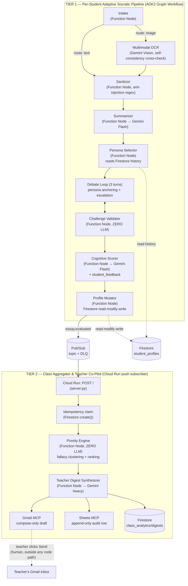

# eduagent — Collaborative Partner Socratic Mentor

> All Things Agentic Hackathon — Track: **Collaborative Partner**
> Philosophy: *using AI to teach students not to depend on AI.*

`eduagent` is a two-tier agentic system built on **Google ADK2 + Gemini (Vertex AI) + Firestore + Pub/Sub + Cloud Run**:

- **Tier 1 (per-student):** a student submits an essay (typed text, a photo of a handwritten one, or a Google Doc share link) and gets challenged by an adversarial Socratic debate persona instead of being handed answers or corrections.
  - **Autonomous Persona Routing:** Diagnoses reasoning weaknesses across 4 dimensions (Evidence, Counterarguments, Logical Consistency, Scope/Generalization) and routes to the matching persona (`The Skeptic`, `The Devil's Advocate`, `The Nitpicker`, `The Expander`) with an explainable routing badge + practice selector.
  - **Full 3-Turn Socratic Debate:** Deep interactive questioning without premature termination.
  - **Cognitive Radar Chart:** Interactive 2D SVG spider/radar polygon chart visualizing scores across 4 reasoning axes (Logical Coherence, Evidence Quality, Scope Awareness, Counterargument Handling).
  - **Metacognitive Self-Correction Loop:** Allows students to submit a revised thesis addressing the diagnosed weaknesses with instant feedback.
- **Tier 2 (class-wide):** every graded essay triggers an event-driven Class Aggregator that clusters shared logical fallacies across a class, ranks which students need attention first (deterministically, not by LLM vibes), and drafts a digest for the teacher — who is the only one who can actually send it.
  - **Dynamic Integrations:** Live Google Sheet audit logging (with URL auto-parsing, smart multi-tab fallback, and a `🧪 Test Sheet Connection` button) and automated Gmail draft synthesis.

---

### 🚀 Try It Out Live (Instant Demo)

You can experience the fully deployed system immediately without any local setup:
* **Live Web App:** [https://eduagent-class-aggregator-636767063018.asia-southeast1.run.app/](https://eduagent-class-aggregator-636767063018.asia-southeast1.run.app/)
* **Demo Passcode:** `eduagent2026` (Shared passcode for both Student & Teacher logins)
  * **Student Portal:** Student ID: `c1_stu01` (or custom e.g. `c1_judge01`) | Passcode: `eduagent2026`
  * **Teacher Portal:** Teacher ID: `c1_teacher` | Passcode: `eduagent2026`

> [!NOTE]
> **Mock Multi-Tenant Sandbox Mode:**
> The system uses a stateless mock login based on your selected portal (Student vs Teacher). You can choose **Student Portal** and enter **any arbitrary ID** following the `<class_id>_<name>` format (e.g., `c1_judge_mark`) with passcode `eduagent2026` to log in. 
> Firestore will dynamically spin up an isolated student profile for that custom ID. Once you complete a Socratic debate under this ID, the new student record will immediately propagate to the **Teacher Portal**'s priority matrix and class roster!

### ⏱️ Judge Quickstart — three paths, by how much time you have

Section 3 below is the full, reproduce-from-scratch guide. It is deliberately thorough, which also makes it long — so here is the short version first.

**(a) 60 seconds — verify nothing, install nothing.** Open the live URL above, sign in to the Student Portal as `c1_stu01` / `eduagent2026`, paste any weakly-argued paragraph, and debate it. Then sign in to the Teacher Portal as `c1_teacher` to see that student appear in the deterministic priority ranking. This is the deployed Cloud Run service, not a local mock.

**(b) 5 minutes — run it locally.** Three commands, assuming Python 3.11+ and a GCP project with the APIs from §3.1:

```bash
pip install -r requirements.txt && cp .env.example .env   # then set GCP_PROJECT_ID
gcloud auth application-default login                     # no service-account key needed
python scripts/doctor.py                                  # 9 preflight checks, tells you exactly what is missing
```

`doctor.py` is the fastest way to find out whether an environment is usable: it verifies ADC, Firestore read/write, the Pub/Sub topic + DLQ + dead-letter policy, the Firestore TTL policy, Gmail/Sheets tokens, Vertex AI model availability, and the live Cloud Run revision — each independently, so one missing optional feature reports WARN instead of blocking the rest. Then:

```bash
python -m pytest tests/ -q -m "not e2e"     # 243 tests, ~16s, zero cloud calls
python scripts/run_eval_suite.py --strict   # 50/50 deterministic eval cases
python scripts/demo_tier1_run.py            # real end-to-end: 3 essays, one student, live Gemini + Firestore
```

**(c) Deploying your own copy.** `python scripts/deploy_to_cloud_run.py` — it preflights the three required Secret Manager secrets and refuses to deploy until they exist, printing the exact `gcloud` commands. Full walkthrough and rationale in §3.10.

**What to look at if you only look at one thing:** run `python scripts/demo_tier1_run.py` and watch the persona change between essay 1 and essay 2 for the same student. That persona rotation is driven by history read back out of Firestore, and it is the project's answer to this track's question about mutating rather than merely reading data.


---

## 1. Mandatory disclosure

This architecture is inspired by the author's personal prior project, **CritiqAI** (entered in a different, earlier competition). **All code in this repository was written from scratch during this hackathon's Submission Period.** No source file, prompt, or data schema was copied from that prior project — it was used only as a case study for lessons learned (see `PROJECT_WIKI.md` section 9). Track: **Collaborative Partner**.

---

## 2. Architecture



> **On node types (ĐỢT 12):** every node in the Tier 1 graph is an ADK2 `FunctionNode` — there is no `AgentNode` anywhere in this project (`grep -rn "AgentNode" src/` returns nothing; see `graph/tier1_pipeline.py`). The three nodes above that reach Gemini do so *inside* a Python function we control, which is the point of the deterministic-first design: every LLM call sits in a testable function with an explicit timeout, retry policy and degradation path. An earlier version of this diagram (and of `docs/For_notebookLM.md`) labelled them "Agent Node", which understated exactly the property that makes the architecture defensible.

**Data flow in one sentence:** an essay (text or photo) goes through a deterministic-first ADK2 graph that debates, scores, and mutates a per-student Firestore profile; every graded essay fires a Pub/Sub event that a separate Cloud Run service picks up to compute a class-wide priority ranking and draft a teacher digest — with exactly one human-in-the-loop gate (the teacher pressing Send in their own Gmail).

### Repo layout

```
src/eduagent/
  nodes/          Tier 1 graph nodes (intake, ocr, summarizer, persona_selector, debate, validator, scorer, mutator)
  skills/         personas.py, debate_escalation.py, language.py — reusable logic, not graph nodes
  memory/         student_profile.py (pure merge logic) + firestore_memory.py (Firestore wrapper)
  aggregator/     Tier 2: priority_engine.py (zero-LLM ranking), digest.py, digest_store.py, idempotency.py, class_aggregator.py
  integrations/   gmail_mcp.py (compose-only), sheets_mcp.py (append-only)
  graph/          tier1_pipeline.py — the ADK2 Workflow wiring
  server.py       Cloud Run entrypoint (Tier 2 Pub/Sub push subscriber)
  llm.py          thin Vertex AI wrapper (text/JSON/multimodal, retry + degrade)
  resilience.py   shared retry policy for Firestore/Pub/Sub/Gmail/Sheets
  interactive.py  turn-by-turn debate helper for a future Web UI/API
scripts/          one-off verification, demo, seed, deploy-adjacent, and diagnostic scripts (see PROJECT_WIKI.md / TODO.md for what each does)
eval/             ADK Eval Suite (evalset.py, results/) + eval/test_images/ (real handwritten essay photos)
tests/            pytest suite — fast unit tests by default, `@pytest.mark.e2e` for the one real-Vertex-AI test
```

---

## 3. Spin-up instructions (from a clean machine)

### 3.1 Prerequisites

- Python 3.11+ (developed against 3.14)
- A GCP project with these APIs enabled: `aiplatform`, `firestore`, `run`, `pubsub`, `cloudtrace`, `logging`, `gmail.googleapis.com`
- A Firestore database (Native mode) in that project
- `gcloud` CLI authenticated, or a service-account key with the roles listed in section 5 below
- (Optional, for Tier 2 delivery channels) a Gmail OAuth Desktop client + a Google Sheet

### 3.2 Install

```bash
git clone https://github.com/francisnguyenanh/EduAgent.git
cd EduAgent
python -m venv .venv && source .venv/bin/activate   # or .venv\Scripts\activate on Windows
pip install -r requirements.txt
cp .env.example .env   # then fill in GCP_PROJECT_ID and the other values
```

`GOOGLE_APPLICATION_CREDENTIALS` in `.env` should point at a service-account key with the roles in section 5 — or omit it entirely and use `gcloud auth application-default login` for local dev.

### 3.3 Verify GCP connectivity before touching the pipeline

```bash
python scripts/doctor.py
```

This checks GCP ADC, Firestore, Pub/Sub topic/DLQ/subscription, the Gmail OAuth token, the Sheets audit spreadsheet, and Vertex AI reachability in one shot — exactly what you want to run before a live demo recording, and the fastest way to find out what's missing on a fresh machine.

### 3.4 Run the fast test suite (no live GCP calls)

```bash
pytest tests/ -q -m "not e2e"
```

Add `-m e2e` (or drop the marker filter) to also run the one test that hits real Vertex AI (`tests/test_tier1_skeleton.py`).

### 3.5 Run Tier 1 for real (text)

```bash
python scripts/demo_tier1_run.py
```

Runs 3 essays for the same (freshly created) student through the real graph against real Vertex AI + Firestore, and prints how persona choice and `score_trend` evolve across essays — the direct evidence for "becomes more helpful over time."

### 3.6 Run Tier 1 with a real handwritten photo (Multimodal OCR)

```bash
python scripts/demo_ocr_run.py                    # 3 real photos -> full pipeline
python scripts/demo_real_handwriting_ocr.py        # OCR node only, all 12 sample photos in eval/test_images/
```

### 3.7 Seed sample class data + run Tier 2 locally

```bash
python scripts/seed_student_profiles.py                       # 5 sample student_profiles documents
python scripts/run_class_aggregator_subscriber.py --once       # pulls essay.evaluated events, runs process_event()
```

Deploy `firestore.indexes.json` once (needed for `GET /api/classes/{class_id}/students`, a class-roster query filtered by `class_id` and ordered by `flags.last_updated` -- Firestore rejects that exact filter+order_by combo without the matching composite index rather than silently full-scanning):

```bash
gcloud firestore indexes composite create --collection-group=student_profiles \
  --field-config field-path=class_id,order=ascending \
  --field-config field-path=flags.last_updated,order=descending
# or: firebase deploy --only firestore:indexes   (if this project also uses the Firebase CLI)
```

### 3.8 Run the ADK Eval Suite

```bash
python scripts/run_eval_suite.py
```

Writes `eval/results/eval_report.{json,md}` — see section 6 for the last committed results.

### 3.9 Run the Cloud Run service locally

```bash
PYTHONPATH=src uvicorn eduagent.server:app --host 0.0.0.0 --port 8080
curl localhost:8080/health-check   # -> {"status": "ok"}
```

### 3.10 Deploy to Cloud Run

Two one-time steps come **first**. `deploy.txt` is the copy-pasteable runbook for all of this.

**(a) Create the session signing secret — required, not optional (ADR-016).**

`auth.py` ships a default signing key that is committed to this public repository. Deploying without overriding it means the live service signs teacher and student tokens with a key anyone can read, so anyone can mint a `role=teacher` token for any `class_id` and read that class's student PII. The ĐỢT 12 audit found exactly this on the live deployment. Because that failure is silent, the code now makes it loud: **the container refuses to start** when it detects Cloud Run (`K_SERVICE`) while the secret is unset, still the default, or shorter than 32 characters.

```bash
printf '%s' "$(openssl rand -base64 48)" | \
  gcloud secrets create eduagent-session-secret --data-file=- --replication-policy=automatic

gcloud secrets add-iam-policy-binding eduagent-session-secret \
  --member=serviceAccount:eduagent-sa@<project>.iam.gserviceaccount.com \
  --role=roles/secretmanager.secretAccessor
```

**(b) Enable the Firestore TTL policy for debate sessions.**

`memory/firestore_session.py` writes an `expire_at` timestamp, but Firestore only deletes documents when a TTL *policy* exists on that field. Without this command the documented 24h retention behaviour simply does not happen and live sessions accumulate indefinitely — another ĐỢT 12 finding, since the claim was in the docs while the policy was never created. `scripts/doctor.py` now checks this and reports FAIL if the policy is missing.

```bash
gcloud firestore fields ttls update expire_at --collection-group=debate_sessions --enable-ttl
gcloud firestore fields ttls list --collection-group=debate_sessions   # expect state: ACTIVE
```

**(c) Demo-only: make the teacher digest fire immediately.**

The Class Aggregator debounces digests per class (`DIGEST_DEBOUNCE.window_seconds`, default **120s**) so a whole class submitting at once does not spam the teacher's inbox. That default is right for real use and wrong for a 4-minute demo: an essay submitted inside the window coalesces, and the Gmail draft does not appear while the camera is rolling. For a demo or recording session, set the window to zero:

```bash
gcloud run services update eduagent-class-aggregator --region asia-southeast1 \
  --update-env-vars EDUAGENT_DIGEST_DEBOUNCE_SECONDS=0
# ...and put it back afterwards:
gcloud run services update eduagent-class-aggregator --region asia-southeast1 \
  --update-env-vars EDUAGENT_DIGEST_DEBOUNCE_SECONDS=120
```

Nothing is lost either way: a coalesced event still has its Tier 1 `student_profiles` write committed, and the next event for that class re-reads every profile fresh — the debounce only skips regenerating the digest.

**Then deploy:**

```bash
gcloud run deploy eduagent-class-aggregator \
  --source . \
  --region <your-region> \
  --service-account eduagent-sa@<project>.iam.gserviceaccount.com \
  --no-allow-unauthenticated \
  --max-instances=5 \
  --concurrency=80 \
  --min-instances=0 \
  --update-secrets EDUAGENT_SESSION_SECRET=eduagent-session-secret:latest \
  --set-env-vars GCP_PROJECT_ID=<project>,GOOGLE_GENAI_USE_VERTEXAI=True

# Then point the class-aggregator-sub subscription at the deployed URL as a
# push subscription with OIDC auth instead of pulling:
gcloud pubsub subscriptions update class-aggregator-sub \
  --push-endpoint=<deployed-service-url>/ \
  --push-auth-service-account=eduagent-sa@<project>.iam.gserviceaccount.com \
  --push-auth-token-audience=<deployed-service-url>
```

**Verified on the real project (ĐỢT 8):** the above two commands were run against the live deployment, then a real test event was published to `essay-evaluated` and confirmed in Cloud Run logs to be picked up and processed by `process_event()` with no pull-mode script running anywhere — i.e. the Pub/Sub → Cloud Run push path in the architecture diagram above is not just deployed, it fires end-to-end.

This project's live deployment (below) is deployed with `--allow-unauthenticated`, so that a judge can open the Web UI without a GCP identity or an OAuth flow. That means Cloud Run IAM does **not** protect the `POST /` Pub/Sub push endpoint — the application itself verifies the push subscription's OIDC token (see ADR-014, `server.py::_verify_pubsub_push_auth`) so `/` still cannot be triggered by an arbitrary unauthenticated caller. If you redeploy this service and do **not** need a public demo UI, prefer `--no-allow-unauthenticated` plus Pub/Sub's own service-agent OIDC token as the sole gate instead — that is the simpler, IAM-only setup and needs no application-layer check.

If you do keep `--allow-unauthenticated` (as this project's live deployment does), also set two extra env vars so `_verify_pubsub_push_auth` can pin the expected caller identity/audience, not just check that *some* valid Google-signed token was presented:

```bash
gcloud run deploy eduagent-class-aggregator \
  --source . \
  --region <your-region> \
  --service-account eduagent-sa@<project>.iam.gserviceaccount.com \
  --allow-unauthenticated \
  --max-instances=5 \
  --concurrency=80 \
  --min-instances=0 \
  --update-secrets EDUAGENT_SESSION_SECRET=eduagent-session-secret:latest \
  --set-env-vars GCP_PROJECT_ID=<project>,GOOGLE_GENAI_USE_VERTEXAI=True,PUBSUB_PUSH_AUDIENCE=<the deployed service URL>,PUBSUB_PUSH_SERVICE_ACCOUNT=<push-subscription-invoker>@<project>.iam.gserviceaccount.com
```

`--max-instances=5`/`--concurrency=80`/`--min-instances=0` (ĐỢT 3 GCP cost hygiene): scale-to-zero when idle, and a hard ceiling so an unexpected traffic spike (or a bug causing retry storms) can't silently burn through hackathon credits by autoscaling unbounded — matches the "make your credits last" guidance in the hackathon rules. These are flags on the deploy command itself; changing them on the already-live service requires re-running `gcloud run deploy` (or `gcloud run services update`) with intent, which this repo does not do automatically.

**Live deployment (this project):** `https://eduagent-class-aggregator-636767063018.asia-southeast1.run.app` (region `asia-southeast1`, same region as Firestore). Verified against the real service:

```bash
curl https://eduagent-class-aggregator-636767063018.asia-southeast1.run.app/health-check
# -> {"status":"ok"}
```

See ADR-011 for a real deploy-time finding: the endpoint is `/health-check`, not the more conventional `/healthz`.

### 3.11 GCP cost/credit protection (budget alert + teardown)

Before leaving this project running unattended for any length of time:

1. **Budget alert:** Console → Billing → Budgets & alerts → Create budget, scope it to this project, set a threshold (e.g. 50%/90%/100% of your hackathon credit grant) with email notifications. This project's actual spend is dominated by Vertex AI calls (Flash-tier, cheap) and Cloud Run (scale-to-zero per §3.10) — Firestore/Pub/Sub/Cloud Trace stay within free-tier at this project's volume.
2. **Artifact Registry cleanup policy** (optional, complements `scripts/cleanup_gcp_artifacts.py`'s on-demand sweep with an always-on one enforced by the registry itself): `gcloud artifacts repositories set-cleanup-policies cloud-run-source-deploy --location=<your-region> --policy=cleanup-policy.json`, where `cleanup-policy.json` keeps the 3 most recent versions and deletes untagged versions older than 7 days. Not applied automatically here — it's a live change to infrastructure already in use, left for you to run deliberately once you've confirmed the retention window you want.
3. **Teardown after judging ends** (irreversible — only run once you're certain the submission window is closed): `gcloud run services delete eduagent-class-aggregator --region <region>`, delete the Pub/Sub topics/subscriptions (`essay-evaluated`, `essay-evaluated-dlq`, `class-aggregator-sub`), and delete the `eduagent-sa` service account key/service account once no longer needed. Firestore data (student profiles, digests) has no ongoing cost at rest for this project's volume, so it's safe to leave for post-submission reference.

---

## 4. Architecture Decision Records

| # | Decision | Reason | Rejected alternative |
|---|---|---|---|
| ADR-001 | Gmail least-privilege is enforced at the **code layer** (never call `.send()`), not the OAuth scope layer. A hard AST-based test (`tests/test_gmail_mcp_never_sends.py`) gates this. | Real testing (2026-08-24) proved `gmail.compose` does **not** block `messages.send()` — Google's own docs describe it as including send. No Gmail scope exists that permits draft creation but blocks send at the credential layer. | Assuming OAuth scope alone would provide the HITL guarantee (the original plan) — proven false by live testing before it could surface in a demo or judge Q&A. |
| ADR-002 | Use `gemini-3.5-flash` (default) and `gemini-3.7-flash` (`heavy_model`) instead of `gemini-3.5-pro`. | `gemini-3.5-pro` does not exist as a publisher model in this project/region (verified via `client.models.list()`) — only the Flash lineage (3.5/3.6/3.7) is available. `heavy_model` still satisfies "Gemini 3.5 or newer" since 3.7 > 3.5. | Blocking on a Pro-tier model that isn't actually available in this environment. |
| ADR-003 | Pub/Sub `max_delivery_attempts = 5` (not 3). | Google Pub/Sub enforces a platform floor of 5 for dead-letter policies — a subscription create with 3 was rejected outright. This is a platform constraint, not a design choice. | Sticking to the original plan's "3 tries then DLQ" framing, which isn't achievable on this platform. |
| ADR-004 | Bilingual (VI/EN) output applies only to the **expression layer** (debate questions, `student_feedback`), never to `summarizer.fallacies_draft`. | `persona_selector` matches personas to weaknesses via English-keyword regex on `fallacies_draft`. Translating fallacy labels to Vietnamese would silently break persona selection (wrong persona chosen, no exception raised) — a bug that would be very hard to notice by eyeballing a demo. | Translating every LLM output field uniformly "for consistency." |
| ADR-005 | ~~`interactive.py`'s turn-by-turn debate session state lives in an **in-process dict**, not Firestore.~~ **SUPERSEDED BY ADR-015.** | The condition this ADR banked on ("fine to lose on a process restart") stopped holding once the service ran multiple Cloud Run instances: a 3-turn debate is 3+ HTTP requests, so turn 2 landing on a different instance lost the debate mid-conversation. Session state now lives in Firestore `debate_sessions/{session_id}` with the in-process dict demoted to a 3-second read cache. Kept here rather than deleted because the *reasoning* still matters: this is Session state, not Memory — it carries a 24h TTL and is torn down on completion, whereas `student_profiles` remains the only long-term store. | Assuming "single process" was a stable property of the deployment. It was true when this was written and false by the time it was deployed behind an autoscaler. |
| ADR-006 | The ADK Eval Suite (`eval/evalset.py` + `scripts/run_eval_suite.py`) uses hand-written deterministic scoring, not `google.adk.evaluation`'s LLM-as-judge framework. | Grading this system's own LLM output with another LLM call is exactly the reward-hacking risk the hackathon's own guidance warns about. Answer-leak/prompt-injection cases re-run the real production validator/sanitizer directly; persona-fidelity cases score real model output against a fixed keyword lexicon via plain string matching — no LLM ever judges another LLM's output here. | Using `rubric_based_evaluator`/`llm_as_judge` out of the box for a faster-to-write suite. |
| ADR-007 | Multimodal OCR runs Gemini Vision **twice** per image and cross-checks the two transcriptions with `difflib`, downgrading confidence to `low` on disagreement regardless of what either call self-reports. | A real blurred test image caused Gemini Vision to self-report `confidence: "high"` while transcribing **completely unrelated, fabricated content** in 2 of 4 manual trials — prompt-only anti-hallucination instructions were not sufficient alone. The cross-check caught the failure 3/3 times after being added. | Trusting the model's single self-reported `confidence` field, or hand-tuning an image-blur heuristic threshold (rejected: no real photo dataset to calibrate a threshold against, high overfitting risk). |
| ADR-008 | Low-confidence OCR output is routed to `pending_essays` (reusing the Phase 4 mechanism for `scores_degraded`), never written into `student_profiles`. | Content Gemini itself is not confident about should never silently become part of a student's permanent, teacher-visible record — same principle as never writing a fabricated score on an LLM outage. | Writing the essay through with a visible-but-ignored confidence flag — too easy for a Web UI/teacher review step to miss. |
| ADR-009 | Multimodal (image) Vertex AI calls use a 60s timeout, not the 30s used for text-only JSON calls. | A real ~2.6MB test photo hit `504 DEADLINE_EXCEEDED` at 30s despite being perfectly legible — image payloads genuinely take longer to process than text prompts. | Keeping one shared timeout constant "for simplicity" — verified wrong against a real (not synthetic) photo. |
| ADR-010 | Digest history documents use `digest_id = event_id` (the triggering Pub/Sub event's id), not a freshly generated UUID. | Reuses the idempotency guarantee already established for `processed_events` (Phase 3) — a redelivered event overwrites the same digest document instead of creating a duplicate history entry. | Minting a new UUID per digest write, which would require a separate dedup mechanism for the history collection. |
| ADR-011 | The Cloud Run health-check endpoint is named `/health-check`, not the more conventional `/healthz`. | Real deploy testing on this project found that the exact literal path `/healthz` gets intercepted and answered with a generic Google-branded 404 by Cloud Run's underlying Knative/Istio infrastructure *before* the request ever reaches the container or even the IAM auth check — confirmed by testing every other path variant (`/healthz/` with a trailing slash, `/HEALTHZ`, and several unrelated nonexistent paths), all of which correctly reached the app/IAM layer. | Assuming `/healthz` is always safe because it's a common convention elsewhere (Kubernetes, many other PaaS) — proven wrong specifically on Cloud Run's serving stack via live testing, not documentation. |
| ADR-012 | Enforce layered prompt-injection sanitization and strict input size bounds at the REST API boundary (`src/eduagent/api.py`), not only inside the ADK graph workflow. | Live web entries (`POST /api/debate/start`, `/start-with-image`, `/start-with-gdoc`, `/turn`) bypass the batch graph runtime to maintain interactive latency. Sanitizing at the API boundary guarantees that every prompt constructed for Vertex AI is cleaned of instruction-override attempts and bounded in size (max 20k chars essay, 4k chars reply, 10MB image), preventing cost-DoS and 504 gateway timeouts. | Relying solely on the ADK Graph's `intake` node to sanitize, which left live interactive HTTP sessions unprotected. |
| ADR-013 | Issue stateless, HMAC-signed scoped access tokens at `/api/auth/login` to prevent Insecure Direct Object References (IDOR) across classes. | All teacher and student analytics endpoints (`/api/classes/{class_id}/*`) require a valid Bearer token and verify that the token's authorized `class_id` matches the path, preventing unauthorized cross-class PII exposure while maintaining zero external identity provider dependencies for hackathon judging. | Trusting client-supplied `class_id` headers or leaving class API paths unverified. |
| ADR-014 | Verify the Pub/Sub push subscription's OIDC token in the application layer (`server.py::_verify_pubsub_push_auth`, using `google.oauth2.id_token.verify_oauth2_token`) instead of relying solely on Cloud Run IAM to gate `POST /`. | Live testing (ĐỢT 8) found the deployed service uses `--allow-unauthenticated` (needed so judges can open the Web UI without a GCP identity) — `curl`-ing `POST /` directly returned `500` (a real internal error from malformed input), proving the request reached the container **unauthenticated**. Cloud Run IAM was not protecting this endpoint at all; a prior README draft claimed otherwise before this was caught. | Assuming `--no-allow-unauthenticated` was in effect because that was the original plan — not verified against the actually-deployed service until this review. |

| ADR-015 | Back live debate sessions with a Firestore `debate_sessions/{session_id}` document, with the in-process dict demoted to a **3-second** read cache (`memory/firestore_session.py`). | A 3-turn debate is 3+ HTTP requests, and Cloud Run load-balances across instances, so in-process-only state lost debates mid-conversation. The 3s bound is the ĐỢT 12 correction to this ADR: the first implementation preferred any cache entry inside the 24h *session* TTL, which meant turn 3 landing back on instance A served a stale copy and then overwrote Firestore with it — the bug this ADR claimed to fix. Turns are gated on a human typing, so a 3s window only absorbs repeat reads within one request. Regression test: `tests/test_firestore_session.py::test_two_instances_do_not_lose_a_debate_turn`, verified to fail against the old cache-first read. | Treating "we added a durable store" as equivalent to "reads use it". Durability without read preference only narrows the failure window. |
| ADR-016 | Refuse to start the process when it detects Cloud Run (`K_SERVICE`) while `EDUAGENT_SESSION_SECRET` is unset, still the committed demo default, or shorter than 32 chars (`auth.py::_resolve_session_secret`). | The default signing key is committed to this public repo, and the ĐỢT 12 audit found it had never been set at deploy time — so the live service was signing tokens with a publicly-known key, and anyone reading the repo could mint a `role=teacher` token for any `class_id` and read that class's student PII. That silently voided ADR-013. A missing env var is a silent failure mode; a container that will not boot is a loud one. Local development still uses the default so `pytest` and a laptop demo need no setup. See `deploy.txt` STEP 1. | Documenting "remember to set the secret" and trusting the deploy step to be remembered — it was not, for the entire life of the deployment. |
| ADR-017 | Implement a real in-process token-bucket rate limiter (`rate_limit.py`) rather than deleting the DoS claim from the STRIDE table. | The STRIDE table asserted "Token bucket rate limiting" while `grep -rniE "rate.?limit\|token.?bucket\|slowapi\|throttl" src/` returned zero results. The exposure was real (each debate call fans out into several Gemini requests on a public URL, so a `curl` loop was an unmetered spend channel), so the honest fix was to build it, not to un-claim it. **Stated scope:** buckets are per-process, so the real ceiling is `N_instances × capacity` — this bounds cost and stops casual abuse; it is not a distributed limiter, and a production deployment belongs behind Cloud Armor / API Gateway. | Either leaving the false claim in a security table, or quietly deleting the row and shipping with no ceiling at all. |
| ADR-018 | Require a Bearer token on all five student-facing debate endpoints, with a `student` token authorized only for its own `user_id` (`server.py::_verify_student_auth`). | `/api/debate/{start,start-with-image,start-with-gdoc,turn,reflect}` accepted an arbitrary caller-supplied `student_id` with no token check at all, while every `/api/classes/*` route was properly gated — on a service deployed `--allow-unauthenticated`. Anyone could write junk into any student's Firestore profile and publish a Pub/Sub event skewing the teacher's ranking. `/api/debate/turn` carries only a `session_id`, so ownership is resolved from the session's own stored `student_id`/`class_id`, and the token is verified **before** the session lookup — otherwise the route was an oracle distinguishing real session ids (403) from fake ones (404), a bug a test caught during this work. A same-class `teacher` token is accepted, since reproducing a student's debate is legitimate. | Assuming the input-size caps from ADR-012 were sufficient protection. A size cap bounds one request; it does not bound who may write to whose record, nor how many requests arrive. |
| ADR-019 | Every eval case must be falsifiable, verified by a sabotage test: break the production code on purpose and confirm the case goes red. | The ĐỢT 12 audit found 12 of 50 eval cases could not fail. Layer 4's eight "cognitive growth" cases subtracted integer literals declared in the fixture file (`8 - 2 >= 4`) and would have passed with `src/` deleted; the persona-fidelity cases rebuilt the system instruction inside the test and then asserted the anchor was in the string they had just concatenated. Both now drive production code (`nodes/debate.py::build_system_instruction`, `merge_reflection_into_profile`, and a measured artifact from a live scorer run). Verified: removing persona anchoring fails 4/4 cases, deleting the measurement artifact fails 4/4 Layer 4 cases. | Treating a green suite as evidence without asking whether any case was *capable* of being red. Reward hacking does not require a reward model — a human writing an assertion that restates its own setup produces the same worthless metric. |

| ADR-020 | Every credential reaches Cloud Run as a Secret Manager reference (`--update-secrets`), never as a plain environment variable — and an AST test fails the build if one is ever inlined again. | An external review flagged the OAuth tokens being passed via `--env-vars-file`, and checking the live service confirmed it: `gcloud run services describe` printed both the Gmail and Sheets **refresh tokens in full**. Cloud Run stores plain env vars in the revision spec in cleartext, so they were readable by anyone with `run.services.get` — a *read* permission granted far more widely than `secretmanager.versions.access`. Mounted secrets appear in the same output as `valueFrom.secretKeyRef`. Chosen over calling the Secret Manager API from application code (the reviewer's suggestion): it needs no new dependency, no cold-start API call, and no code change at all, since Cloud Run injects the value into the same env var the integrations already read. | Treating ADR-016 as "the secrets problem is handled". It moved the *signing key* to Secret Manager and left two OAuth tokens inline — same class of exposure, missed because the fix was scoped to the one secret being discussed. |

| ADR-021 | The turn-by-turn debate bridge in `interactive.py` is the **intended architecture** for this graph, not a stopgap pending ADK interrupt/resume. | Phase 1 recorded a plan to replace it "using ADK2 Workflow's interrupt/resume (`RequestInput`)", and that plan rested on a factual error carried for four phases: `RequestInput` is **not** a `Workflow` primitive. In `google-adk` 2.3.0, `google.adk.workflow` exports only BaseNode/Edge/FunctionNode/JoinNode/Node/NodeTimeoutError/RetryConfig/START/Workflow — the import raises `ImportError`. The real `RequestInput` lives in `google.adk.events.request_input`, wired by `google.adk.tools._request_input_tool` as a `LongRunningFunctionTool` for the **LLM agent tool-calling flow**; a graph made entirely of `FunctionNode`s never enters that flow. Reaching it would mean turning the debate node into an `LlmAgent`, handing the model control over persona anchoring, escalation order and termination — discarding the deterministic-first property the whole codebase is organised around. | Carrying a "we'll fix this properly later" note for four phases without ever checking that the mechanism it named existed. The note was more expensive than the limitation: it framed a correct design as technical debt. |

| ADR-022 | The metacognitive reflection is bound to a **completed debate session**: `/api/debate/reflect` takes only `session_id` + `revised_claim`, and a finished session survives scoring in a terminal state (`completed: true`) so it can be claimed exactly once (`interactive.claim_reflection()`). | The endpoint used to accept `student_id`, `class_id`, `original_claim` and `original_fallacy` from the request body, with nothing tying them to a debate. That single design mistake produced two separate holes, which is why they close with one change. (1) **Score farming:** a bare POST credited `growth_bonus` and `breakthrough_count` with no essay and no debate behind it — ADR-018 stopped a student farming *someone else's* profile but not their own in a loop, which is worse for the product, because the metacognitive number the teacher reads stopped meaning "this student revised their thinking". (2) **Prompt injection:** `original_claim` and `original_fallacy` went into the Gemini prompt unsanitized while only `revised_claim` was cleaned — ADR-012's layered rule violated at the one endpoint nobody re-checked after ADR-012 was written. Reading both off the server's own session record removes the forgeable fields entirely instead of adding a second sanitizer. The claim flag is written **before** the LLM call, so a double-clicked submit cannot bank two bonuses while the first request waits on Gemini. | Scoring the debate and then **deleting** the session, which destroyed the only proof the debate happened — and so forced the step that comes *after* completion to trust the client for everything. "Tear down when the last turn ends" was the wrong end of the flow. |
| ADR-023 | `score_trend` reports **`volatile`** as a distinct verdict, and its slope is an explicit least-squares fit (`student_profile.py::_trend_slope`) rather than `sum(diffs) / len(diffs)`. | The old expression telescoped — `(x1-x0) + (x2-x1)` collapses to `x2-x0` — so it only ever read the first and last essay in the window. At `TREND_WINDOW == 3` an OLS fit gives the identical number, so this half is a clarity fix that also keeps the code correct if the window widens; a regression test pins the two apart at n=5. The behavioural half is the audit's real complaint: a student scoring `[10, 0, 10]` has a genuinely flat *trend*, so the old code called it `stagnant` and it contributed **0** to the Intervention Priority Index — ranked identically to a student holding a steady 5. A whole essay collapsing and recovering deserves a teacher's attention; a steady score does not. So the slope keeps its honest meaning and the swing becomes its own signal, weighted (`PRIORITY_WEIGHTS.score_volatility = 1.5`) below a sustained `declining` (2.5). | Relabelling the dip as `declining` to make it rank. That would raise the right student for a reason that is false — the teacher would be told the student is heading down when they are not — and the parent note drafted from that `reason` block would repeat it. |

(ADR-001 through ADR-003 were captured live in `TODO.md` during Phase 0/3; ADR-004 onward were captured during the "Cải tiến Đợt 2" and Phase 5/6 work; ADR-012 & ADR-013 were added during Phase 7/ĐỢT 6; ADR-014 was added during ĐỢT 8; ADR-015 during ĐỢT 10 and **corrected** in ĐỢT 12; ADR-016 through ADR-019 came out of the ĐỢT 12 full audit; ADR-020 from an external review in ĐỢT 14; ADR-021 from a second external review in ĐỢT 15; ADR-022 and ADR-023 from the ĐỢT 15 senior-engineer audit (2026-08-26) — see `TODO.md` and `PROJECT_WIKI.md` section 12 for the full narrative and verification evidence behind each one.)

---

## 5. Security model

- **Service account (`eduagent-sa`)**: exactly 5 roles, no Owner/Editor — `datastore.user`, `pubsub.editor`, `aiplatform.user`, `cloudtrace.agent`, `logging.logWriter`.
- **Gmail**: OAuth scope `gmail.compose` only; **the codebase itself never calls `.send()`** anywhere in the digest flow (see ADR-001) — enforced by an AST-based test (`tests/test_gmail_mcp_never_sends.py`), not just code review discipline. The actual HITL gate is the teacher clicking Send in their own Gmail client, a human action entirely outside this system's code path.
- **Sheets**: `append_audit_row()` is the only exported write — no update/delete, so the audit trail can't be quietly edited by a bug or a future feature.
- **Cloud Run**: this project's live deployment uses `--allow-unauthenticated` (so a judge can open the Web UI directly), which means Cloud Run IAM does not gate `POST /`. Instead, `server.py::_verify_pubsub_push_auth` verifies the Pub/Sub push subscription's OIDC token in the application layer using `google.oauth2.id_token.verify_oauth2_token` (real signature verification against Google's public keys, not a shared secret) before `process_event()` ever runs — see ADR-014. A redeploy that doesn't need a public UI should prefer `--no-allow-unauthenticated` instead, which needs no application-layer check.
- **Authentication & Authorization**: `auth.py` provides a lightweight, stateless role-based authentication model with a shared demo passcode (`eduagent2026`) designed specifically for streamlined hackathon judging without external IdP dependencies. Scoped HMAC-signed session tokens enforce multi-tenant isolation, ensuring a logged-in user in class `c1` cannot inspect or modify rosters/digests in other classes (IDOR prevention, see ADR-013).
- **Session signing key (ADR-016)**: the token-signing secret must come from Secret Manager at deploy time. Since the repo's fallback default is public, the process **refuses to start** on Cloud Run while that default is still in effect — see §3.10(a). `scripts/doctor.py` reports which key is in use before a demo.
- **Reflection requires a real, finished debate (ADR-022)**: `/api/debate/reflect` carries only a `session_id`; the student identity, the original essay and the fallacy being revised are all read from the server's session record, and each finished debate can be reflected on exactly once. Covered by `tests/test_metacognitive_reflection.py` and `tests/test_interactive_persistence.py`.
- **Student-facing endpoint authorization (ADR-018)**: all five debate endpoints require a Bearer token; a `student` token may act only as its own `user_id`, and `/api/debate/turn` resolves ownership from the session's stored `student_id`/`class_id` rather than from the request, verifying the token *before* the session lookup so the route is not an existence oracle. A same-class `teacher` token is also accepted. Covered by `tests/test_student_endpoint_auth.py`.
- **Rate limiting (ADR-017)**: `rate_limit.py` applies a per-IP token bucket to the debate endpoints (burst 10, sustained 1 per 5s) and to `/api/auth/login` (burst 5, sustained 1 per 10s), returning `429` with `Retry-After`. **Honest scope:** buckets are per-process, so the real ceiling is `N_instances × capacity`. This bounds Vertex AI spend and stops casual abuse; it is not a distributed limiter, and a production deployment belongs behind Cloud Armor / API Gateway.
- **Session retention**: `debate_sessions` documents carry a 24h `expire_at` **and** an ACTIVE Firestore TTL policy on that field (§3.10(b)) — verified via `gcloud firestore fields ttls list`, since writing the field alone deletes nothing.
- **Layered Prompt-Injection Defense**: Regex sanitization (`strip_injection_attempts`) executes at both the HTTP API boundary (`api.py`) and the ADK workflow graph (`intake.py`), ensuring that essays, OCR outputs, GDocs, and turn-by-turn student replies are stripped of instruction-override attempts before LLM prompt construction.
- **Input Boundaries & Cost-DoS Protection**: Strict upper bounds are enforced on all ingress vectors (max 20,000 chars for essays, max 4,000 chars for debate replies, max 10MB for base64 handwriting images, max 100KB for Google Doc fetches).
- **XSS & Output Hygiene**: The Web UI uses contextual HTML escaping (`esc()`), strict `textContent` DOM node population, and event delegation to prevent stored XSS attacks across student submissions and teacher dashboards.
- **Validator independence**: `nodes/validator.py` never imports `eduagent.llm` — verified by reading the module, not just by convention — so the same LLM call that generates a debate question can never also be the one judging it.
- **Credentials at deploy time (ADR-020)**: all three secrets — the session signing key, the Gmail OAuth token and the Sheets OAuth token — are mounted from **Secret Manager** via `--update-secrets`, so the revision spec holds only `valueFrom.secretKeyRef` pointers. `scripts/deploy_to_cloud_run.py` preflights that all three exist and refuses to deploy otherwise, and `tests/test_deploy_never_inlines_secrets.py` is an AST-based hard gate against re-inlining one. Verify on a live revision with `gcloud run services describe ... --format='value(spec.template.spec.containers[0].env)'` — no credential value should be printed.
- **Secrets**: `.env`, `secrets/`, `*-key.json`, `*service-account*.json`, `client_secret_*.json` are all gitignored; `git log --all` was scanned for API-key/private-key patterns and old-repo filenames before every phase checkpoint (see `TODO.md` Phase 0/7) — clean.

---

## 6. ADK Eval Suite results

Last run — **50/50 deterministic test cases passed**. Full machine-readable report in `eval/results/eval_report.md` / `.json`.

Read that as "the test suite is green", **not** "the system is 100% correct". Those are different claims.

| Layer | Group | Passed | Total | What it actually executes |
|---|---|:---:|:---:|---|
| 1. Safety & Security | `answer_leak` | 6 | 6 | the real `validate_debate_turn()` |
| 1. Safety & Security | `prompt_injection` | 5 | 5 | the real `strip_injection_attempts()` |
| 1. Safety & Security | `tenancy_isolation` | 4 | 4 | the real `server._verify_class_auth()` used by the HTTP routes |
| 2. Behavioral Discipline | `persona_fidelity` | 4 | 4 | the real `debate.build_system_instruction()` — anchor present on all 3 turns, anchors mutually distinct, no cross-persona signature collision |
| 2. Behavioral Discipline | `single_question_constraint` | 4 | 4 | the real validator |
| 2. Behavioral Discipline | `formatting_bounds` | 4 | 4 | the real validator |
| 2. Behavioral Discipline | `escalation_protocol` | 3 | 3 | the real escalation instruction table |
| 3. Long-Term Memory | `memory_adaptation` | 10 | 10 | the real `merge_essay_into_profile()`, `_score_trend()`, `_build_prompt()` |
| 4. Learning Outcomes | `metacognitive_growth_logic` | 6 | 6 | the real `merge_reflection_into_profile()` |
| 4. Learning Outcomes | `measured_learning_outcome` | 4 | 4 | assertions against `eval/results/learning_outcome_measured.json`, produced by a live-scorer measurement run |
| | **Overall** | **50** | **50** | |

No LLM judges another LLM's output anywhere in this suite (ADR-006).

**Falsifiability (ADR-019).** The ĐỢT 12 audit found 12 of these 50 cases could not fail: Layer 4's eight "growth" cases subtracted integer literals declared in the fixture file (`8 - 2 >= 4`, green even with `src/` deleted), and the persona-fidelity cases rebuilt the system instruction inside the test before asserting the anchor was in the string they had just built. Both were rewritten to drive production code, then checked by sabotage:

| Sabotage | Result |
|---|---|
| Remove persona anchoring from `build_system_instruction()` | 4/4 persona cases FAIL |
| Delete `learning_outcome_measured.json` | 4/4 measured Layer 4 cases FAIL |

**Opt-in live mode.** `python scripts/run_eval_suite.py --live-persona` runs the real 3-turn debate against Gemini and matches the model's actual questions against each persona's lexicon, writing to a *separate* report (`eval_report_live_persona.md`) so the main suite keeps its zero-LLM guarantee. Its current result is worth stating plainly: **2 of 4 personas drift** — the Devil's Advocate and the Nitpicker both slide into the Skeptic's evidence-and-causation register on a hard essay. Anchoring keeps the instruction in the prompt; it does not guarantee the model obeys it. We left that failure in the report rather than widening the lexicons until it went green.

---

## 7. Multimodal ingestion evidence

`eval/test_images/` contains 12 real handwritten essay photos (neat, messy with cross-outs, cursive, pencil, tilted, low-light/faded, bullet-point notes) used to validate `nodes/ocr.py` end-to-end. Last real run against Vertex AI: 9 `confidence=high`, 1 `medium` (correctly the one with visible cross-outs), 2 `low` (correctly the two hardest-to-parse bullet-point note images) — matching a human's own judgment of each photo's legibility. See `scripts/demo_real_handwriting_ocr.py` to reproduce.
