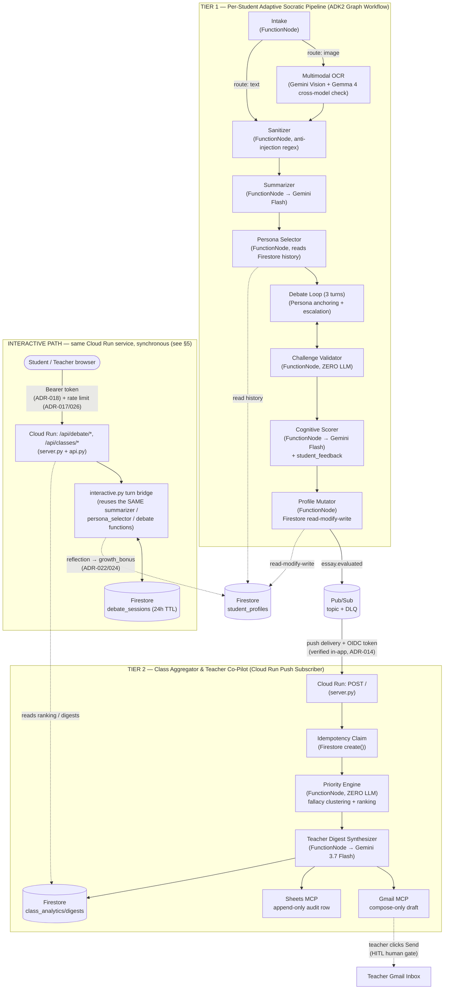

# EduAgent — Autonomous Socratic Collaborative Partner

[](https://cloud.google.com/)
[](https://github.com/google/agent-development-kit)
[](https://cloud.google.com/vertex-ai)
[](eval/results/eval_report.md)
[](LICENSE)

> **All Things Agentic Hackathon** — Track: **Collaborative Partner**  
> *Philosophy: "Using AI to teach students how NOT to depend on AI."*

---

`EduAgent` is a two-tier agentic platform built on **Google ADK2 + Gemini (Vertex AI) + Firestore + Pub/Sub + Cloud Run**:

* **Tier 1 (Per-Student Adaptive Socratic Partner):** Students submit essays via typed text, Google Doc share links, or photos of messy handwriting. Instead of rewriting or handing out answers, the agent actively challenges them through an adversarial Socratic debate loop.
  * **Autonomous Persona Routing:** Diagnoses reasoning weaknesses across 4 cognitive dimensions (*Evidence, Counterarguments, Logical Coherence, Scope*) and routes to specialized personas (`The Skeptic`, `The Devil's Advocate`, `The Nitpicker`, `The Expander`).
  * **Escalating 3-Turn Socratic Debate:** Deep back-and-forth dialogue anchored to maintain persona fidelity without premature termination.
  * **Zero-LLM Independent Challenge Validator:** Fast regex-based guards ensure the model never leaks answers, corrections, or off-topic prompts.
  * **Interactive Cognitive Radar Chart:** 2D SVG spider chart mapping cognitive progression across 4 reasoning axes.
  * **Metacognitive Self-Correction Loop:** Guides students to submit revised theses directly addressing diagnosed weaknesses with instant feedback.
* **Tier 2 (Class-Wide Aggregator & Teacher Co-Pilot):** Every evaluated essay triggers an event-driven Class Aggregator that clusters shared fallacies across a cohort, calculates a deterministic intervention priority index (zero LLM vibes), and drafts actionable teacher digests with human-in-the-loop controls.
  * **Dynamic Integrations:** Real-time Google Sheet audit logging (auto URL parsing, smart multi-tab fallback, live connection testing) and automated Gmail draft composition.

---

## 🚀 Live Demo & Judge Quickstart

Experience the live deployed system on Google Cloud without local installation:

* **Live Web Application:** [https://eduagent-class-aggregator-636767063018.asia-southeast1.run.app/](https://eduagent-class-aggregator-636767063018.asia-southeast1.run.app/)
* **Demo Passcodes — the two roles use different passcodes (ADR-025):**
  * **Student Portal:** ID: `c1_stu01` (or custom ID e.g. `c1_judge01`) | Passcode: `eduagent2026`
  * **Teacher Portal:** ID: `c1_teacher` | Passcode: `eduagent-teacher-2026`
  * *Why two:* a student who knows the passcode handed out in class must not be able to log in as
    the teacher and read the whole class's names, scores and weakness history. The teacher passcode
    is mounted from Secret Manager (`eduagent-teacher-password`) and is published here only so a
    judge can open both portals without a GCP identity — see the *Stated scope* note in §5.

> [!NOTE]
> **Mock Multi-Tenant Sandbox Mode:**
> Select **Student Portal** and enter any custom ID following `<class_id>_<name>` (e.g., `c1_judge_david`) with passcode `eduagent2026`. Firestore dynamically spins up an isolated profile. When you complete a Socratic debate, that record immediately propagates to the **Teacher Portal**'s priority matrix and class analytics roster.

---

### ⏱️ Judge Verification Paths

#### Path A: 60 Seconds (Zero Install, Live Cloud Run)

1. Open the [Live Web Application](https://eduagent-class-aggregator-636767063018.asia-southeast1.run.app/).
2. Sign in to the **Student Portal** (`c1_stu01` / `eduagent2026`), select a sample preset or upload an essay, and complete a 3-turn Socratic debate.
3. Sign in to the **Teacher Portal** (`c1_teacher` / `eduagent-teacher-2026`) to observe that student updated in the class priority ranking and systemic fallacy cluster.

#### Path B: 5 Minutes (Local Quickstart with GCP ADC)

Run locally against Python 3.11+:

```bash
# 1. Install dependencies & configure project
pip install -r requirements.txt && cp .env.example .env   # set GCP_PROJECT_ID

# 2. Authenticate Application Default Credentials (no SA key download needed)
gcloud auth application-default login

# 3. Run comprehensive environment diagnostics (11 independent checks)
python scripts/doctor.py

# 4. Run test & evaluation suites
pytest tests/ -q -m "not e2e"               # 240+ unit tests (~15s, zero cloud cost)
python scripts/run_eval_suite.py --strict   # 50/50 deterministic eval benchmarks
python scripts/demo_tier1_run.py            # Live end-to-end run: 3 essays, Gemini + Firestore
```

> **Key Demonstration:** Running `python scripts/demo_tier1_run.py` demonstrates the persona dynamically rotating between Essay 1 and Essay 2 as it reads prior student history out of Firestore—proving persistent adaptation over stateless interactions.

#### Path C: Deploy Your Own Copy to Cloud Run

Run `python scripts/deploy_to_cloud_run.py` — preflights all Secret Manager secrets and validates required IAM roles before provisioning.

---

## 1. Mandatory Disclosure

This architecture is inspired by the author's prior hackathon entry, **CritiqAI**. **All code, prompts, schemas, workflows, and evaluation suites in this repository were written completely from scratch during this Submission Period.** The prior project served solely as a case study for architectural lessons learned (documented in `overview/PROJECT_WIKI.md` Section 9 — that file is written in Vietnamese; this
paragraph is the authoritative English statement of the boundary). Track: **Collaborative Partner**.

---

## 2. Architecture & Data Flow



> **Deterministic-First Node Design:** Every node in the Tier 1 ADK2 graph is a `FunctionNode`—there are zero opaque agent nodes (`grep -rn "AgentNode" src/` returns 0 results). Calls to Gemini occur *inside* deterministic Python functions with explicit timeouts, retry policies, and automated fallback modes.

### Repository Structure

```
src/eduagent/
  nodes/          Tier 1 graph nodes (intake, ocr, summarizer, persona_selector, debate, validator, scorer, mutator)
  skills/         personas.py, debate_escalation.py, language.py (reusable domain logic)
  memory/         student_profile.py (pure merge logic) + firestore_memory.py (Firestore client)
  aggregator/     Tier 2: priority_engine.py (zero-LLM ranking), digest.py, digest_store.py, idempotency.py
  integrations/   gmail_mcp.py (compose-only), sheets_mcp.py (append-only)
  graph/          tier1_pipeline.py (Google ADK2 Workflow wiring)
  server.py       Cloud Run entrypoint (FastAPI + Pub/Sub push subscriber)
  llm.py          Vertex AI client wrapper (text/JSON/multimodal with retry & degradation)
  resilience.py   Shared retry and exponential backoff policies
  rate_limit.py   Per-IP token-bucket rate limiter
eval/             ADK Eval Suite (evalset.py, results/) + eval/test_images/ (handwritten test assets)
scripts/          Diagnostic tools (doctor.py), demos (demo_tier1_run.py), and deployment automation
tests/            Pytest test suite (>240 tests, unit + integration)
docs/             Submission artefacts (Devpost draft, video script, failure matrix, eligibility statement)
overview/         PROJECT_WIKI.md (full design narrative + ADR history, Vietnamese) + the official rules text
assets/           gcp_evidence/ (Cloud Console screenshots) + sample_essays/
```

---

## 3. Spin-Up & Reproduction Guide

### 3.1 Prerequisites

* Python 3.11+
* Google Cloud Platform project with enabled APIs: `aiplatform`, `firestore`, `run`, `pubsub`, `cloudtrace`, `logging`, `secretmanager`, `gmail.googleapis.com`
* Firestore Database (Native mode)
* Authenticated `gcloud` CLI or Service Account with roles detailed in [Section 5](#6-security--threat-model)

### 3.2 Installation & Connectivity Preflight

```bash
git clone https://github.com/francisnguyenanh/EduAgent.git
cd EduAgent
python -m venv .venv && source .venv/bin/activate
pip install -r requirements.txt
cp .env.example .env   # Configure GCP_PROJECT_ID

# Verify environment readiness
python scripts/doctor.py
```

### 3.3 Running Automated Tests & Local Demos

```bash
# 1. Fast test suite (zero cloud calls)
pytest tests/ -q -m "not e2e"

# 2. Run Tier 1 interactive demo (Text)
python scripts/demo_tier1_run.py

# 3. Run Multimodal OCR on real handwriting photos
python scripts/demo_real_handwriting_ocr.py

# 4. Run the 4-Layer Deterministic ADK Eval Suite
python scripts/run_eval_suite.py --strict
```

### 3.4 Deploying to Cloud Run

1. **Create Session Secret & Mount Credentials (Secret Manager):**

   ```bash
   printf '%s' "$(openssl rand -base64 48)" | \
     gcloud secrets create eduagent-session-secret --data-file=- --replication-policy=automatic
   ```

2. **Enable Firestore TTL Policy on Sessions:**

   ```bash
   gcloud firestore fields ttls update expire_at --collection-group=debate_sessions --enable-ttl
   ```

3. **Deploy Container:**

   ```bash
   python scripts/deploy_to_cloud_run.py
   ```

---

## 4. Architecture Decision Records (ADRs)

The table below summarizes our 27 architectural decisions. Expand any section for full context, rationales, and rejected alternatives.

| ID | Title | Category | Core Decision & Impact |
| :---: | --- | --- | --- |
| **ADR-001** | Code-Level Gmail Gate | Security | Least-privilege enforced via AST test banning `.send()`; OAuth scope alone does not block send. |
| **ADR-002** | Gemini Model Lineup | LLM | Uses `gemini-3.5-flash` & `gemini-3.7-flash` based on regional Vertex AI model availability. |
| **ADR-003** | Pub/Sub Delivery Floor | Infrastructure | Sets `max_delivery_attempts = 5` to satisfy GCP dead-letter platform constraints. |
| **ADR-004** | Bilingual Expression Layer | Pedagogical | Keeps internal fallacy tags in English for regex routing; translates only user-facing prompts. |
| **ADR-005** | Distributed Session Store | Architecture | Superseded by ADR-015 (migrated from in-process dict to Firestore). |
| **ADR-006** | Zero LLM-as-Judge Evals | Evaluation | Replaces subjective LLM graders with deterministic regex and string assertions. |
| **ADR-007** | Dual-Pass OCR Verification | Multimodal | Two independent transcription passes compared with `difflib` to catch hallucinations a model self-reports as confident. Extended cross-*model* by ADR-028. |
| **ADR-008** | OCR Failure Isolation | Data Integrity | Routes low-confidence OCR to review queue (`pending_essays`), protecting student records. |
| **ADR-009** | Multimodal Latency Cap | Resilience | Configures 60s timeout for vision calls vs. 30s for text prompts to accommodate payloads. |
| **ADR-010** | Event Idempotency Keying | Data Integrity | Pins `digest_id = event_id` to prevent duplicate digest records upon Pub/Sub redelivery. |
| **ADR-011** | Health-Check Path Selection | Infrastructure | Uses `/health-check` to bypass Cloud Run's reserved Knative `/healthz` 404 interception. |
| **ADR-012** | API Gateway Sanitization | Security | Enforces regex sanitization and payload bounds directly at FastAPI REST boundaries. |
| **ADR-013** | HMAC Scoped Tokens | Security | Issues stateless HMAC-signed access tokens to enforce multi-tenant class boundary isolation. |
| **ADR-014** | Push Webhook OIDC Verify | Security | Implements application-layer Google OIDC signature verification for Pub/Sub push endpoints. |
| **ADR-015** | Firestore Durable Sessions | State | Backs active debates with Firestore documents; reads prefer Firestore, the in-process dict is a no-durable-store fallback only. |
| **ADR-016** | Fail-Fast Session Secret | Security | Container aborts boot on Cloud Run if default repo signing secret is detected. |
| **ADR-017** | Token-Bucket Rate Limiter | Security | Token-bucket limiting on every Gemini-invoking route (debate endpoints + parent-note) and login, keyed on the last trusted proxy hop. |
| **ADR-018** | Student Route Authorization | Security | Requires Bearer token on all student debate routes; derives ownership from session state. |
| **ADR-019** | Falsifiable Sabotage Evals | Evaluation | Enforces that every eval benchmark is verified capable of failing via code sabotage tests. |
| **ADR-020** | Secret Manager Mounting | Security | Mounts all credentials via `--update-secrets` (`secretKeyRef`), banning cleartext env vars. |
| **ADR-021** | Deterministic Graph Bridge | Architecture | Purpose-built FunctionNode debate bridge preserving deterministic persona orchestration. |
| **ADR-022** | Metacognitive Session Boundary | Integrity | Restricts `/api/debate/reflect` to terminal completed sessions; prevents multi-submit score farming. |
| **ADR-023** | Least-Squares Trend Volatility | Analytics | Introduces linear OLS regression for score trends; flags 'volatile' trajectory as priority signal. |
| **ADR-024** | Outage Cannot Mint Growth | Data Integrity | An unevaluated reflection records as `resolved=false`; `growth_bonus` clamped; the claim is transactional. |
| **ADR-025** | Teacher Token Issuance Gate | Security | Separates teacher login from the public demo passcode, closing the issuance half of ADR-016. |
| **ADR-026** | Trust Only the Proxy's Hop | Security | Rate-limit key comes from the **last** `X-Forwarded-For` entry; earlier hops are caller-supplied and forgeable. |
| **ADR-027** | One Cache, Not Two | State | Session reads go to Firestore first; a second unbounded in-process cache had shadowed ADR-015's 3s bound. |
| **ADR-028** | Cross-*Model* OCR Check | Multimodal | The cross-check's second pass runs **Gemma 4**, not a second Gemini call — two passes of one model share one blind spot. |

<details>
<summary><b>🔍 Expand Detailed ADR Descriptions (ADR-001 through ADR-028)</b></summary>

### ADR-001: Gmail Least-Privilege Enforced at Code Layer

* **Context:** Google's `gmail.compose` OAuth scope officially permits message transmission (`messages.send()`).
* **Decision:** Code never calls `.send()`. A strict AST-based unit test (`tests/test_gmail_mcp_never_sends.py`) fails the CI build if `.send()` is ever introduced. The human teacher clicking Send in their email client is the sole gate.
* **Rejected Alternative:** Relying solely on OAuth scope boundaries.

### ADR-006: Deterministic Evaluation Harness (Zero LLM-as-Judge)

* **Context:** Using an LLM to evaluate another LLM creates reward-hacking vulnerabilities.
* **Decision:** Evaluation benchmarks use deterministic regex, AST parsers, and string matching against production validators.
* **Rejected Alternative:** `google.adk.evaluation` LLM-as-judge scoring.

### ADR-007: Dual-Pass OCR Self-Consistency Cross-Check

* **Context:** Vision models can self-report "high" confidence while hallucinating text on blurred images.
* **Decision:** Transcribe the image twice independently and compare the two texts with `difflib.SequenceMatcher`. If similarity drops below the threshold, downgrade confidence to `low` — never upgrade. ADR-028 later moved the second pass to a different model family, and the comparison runs on **raw** text: Wave 25 tried normalising first and measurement showed it scoring three legible images *worse*, so it was reverted (the reasoning is recorded in `nodes/ocr.py` beside the thresholds).
* **Rejected Alternative:** Trusting model self-reported confidence scores.

### ADR-015: Durable Firestore Sessions with Bounded Read Cache

* **Context:** Cloud Run multi-instance autoscaling caused in-memory debate turns to drop across instances.
* **Decision:** Session state persists in Firestore `debate_sessions/{id}` with a 24h TTL policy. In-memory caching is capped at a strict 3-second freshness window.
* **Rejected Alternative:** Pure in-memory session dictionaries.

### ADR-016: Fail-Fast Protection on Default Signing Secret

* **Context:** Running production with public repository secret keys enables unauthorized token minting.
* **Decision:** `auth.py::_resolve_session_secret()` inspects `K_SERVICE` and terminates startup (`InsecureConfigurationError`) if the secret is missing or set to the default.
* **Rejected Alternative:** Allowing fallback execution with a warning log.

### ADR-019: Falsifiable Benchmarks via Sabotage Verification

* **Context:** Audits revealed that 12 legacy eval cases passed unconditionally regardless of code changes.
* **Decision:** Every evaluation benchmark must be tested against intentional code sabotage (e.g. stripping persona anchors or deleting artifacts) to verify test failure.
* **Rejected Alternative:** Assuming green test suites indicate validity without failure testing.

### ADR-020: Secret Manager Credential Delivery

* **Context:** Cloud Run environment variables appear as cleartext in revision specs.
* **Decision:** Mount all credentials (`EDUAGENT_SESSION_SECRET`, `GMAIL_COMPOSE_TOKEN_JSON`, `SHEETS_TOKEN_JSON`) via Secret Manager references (`--update-secrets`). Enforced via AST build tests and preflight checks.
* **Rejected Alternative:** Inlining JSON strings into environment files.

### ADR-022: Metacognitive Reflection Session Boundary

* **Context:** Metacognitive reflection must be bound to a completed Socratic debate. Previously, client bodies passed raw identifiers, allowing infinite score farming loops.
* **Decision:** `/api/debate/reflect` receives only `session_id` + `revised_claim`. Session state is resolved server-side. Once reflected, the session is marked completed and cannot be claimed again.
* **Rejected Alternative:** Deleting the session immediately upon turn 3, which loses audit logs and forces client trust.

### ADR-023: Linear Least-Squares Regression and Volatility Verdict

* **Context:** Score trends previously used telescoping averages, reading only the first and last essays. Volatile dip patterns like `[10, 0, 10]` were labeled stagnant (adding 0 to teacher priority index).
* **Decision:** Implement Least-Squares Linear Regression for slope analysis. Introduce the `volatile` trend category when slope is flat but variance exceeds threshold, adding `1.5` to teacher priority weights.
* **Rejected Alternative:** Labeling dips as 'declining' which misreports trajectory details to teachers and parents.

### ADR-024: A Model Outage May Not Mint Cognitive Growth
* **Context:** `/api/debate/reflect` handled `LLMGenerationError` by setting `resolved=True, growth_bonus=0.5` and persisting it, so a Vertex AI outage wrote a permanent, teacher-visible "Cognitive Breakthrough" into `student_profiles` for any string at all — and the UI rendered the identical green panel, so nothing on screen distinguished it from a real evaluation. This is what ADR-008 exists to forbid ("never write a fabricated score on an LLM outage"); the rule had simply never been applied to `breakthrough_count`. A test asserted the wrong behaviour, which is why a green suite did not catch it.
* **Decision:** A degraded evaluation records the attempt with `resolved=false` (which stops `merge_reflection_into_profile()` incrementing `breakthrough_count` or `total_growth_bonus`), always returns `degraded` so the UI can render an amber "Not evaluated yet" panel, clamps `growth_bonus` to 0.0–1.0 instead of trusting the model, and hands the reflection claim back so an outage is retryable rather than permanent.
* **Rejected Alternative:** Returning 503 and persisting nothing — loses the audit trail that the student did submit a revision.

### ADR-025: Teacher Token Issuance, Not Just Forgery
* **Context:** ADR-016 described the exposure it closed as "anyone who reads the repo can mint a `role=teacher` token for any `class_id`". It closed the **forgery** route (the signing key) and left the **issuance** route open: `POST /api/auth/login` returns a teacher token for any `class_id` to anyone presenting the shared demo passcode, which this README publishes. One `curl` reproduced the exact outcome ADR-016 claimed to prevent.
* **Decision:** Teacher login honours its own `EDUAGENT_TEACHER_PASSWORD` when configured, falling back to the shared passcode so a laptop demo and `pytest` need no setup. Because that fallback is the judging default, `scripts/doctor.py` reports a WARN naming the exposure whenever it is in effect, and `scripts/deploy_to_cloud_run.py` mounts the secret when it exists — an ADR that production cannot reach is the ADR-016 failure mode all over again.
* **Rejected Alternative:** Adding a real IdP (out of scope), or leaving the claim as-is — a security table that overstates its coverage costs more credibility than the gap.

### ADR-026: A Rate-Limit Key May Only Come From the Hop the Proxy Vouches For
* **Context:** `client_key()` took the **first** entry of `X-Forwarded-For`, with a docstring asserting that Cloud Run appends and therefore *later* entries are attacker-supplied. That is backwards: Cloud Run appends the *real* client address, so the first entry is fully caller-controlled. Measured against the live service — with one key's bucket drained to `429`, eight consecutive requests carrying random spoofed `X-Forwarded-For` values were all served (each got a fresh bucket), and the drained bucket returned `429` again the instant spoofing stopped, ruling out refill. Cloud Logging showed `client_key = 9.9.9.9` (the forged value) while `httpRequest.remoteIp` held the true address throughout. ADR-017's cost-DoS mitigation was bypassable with one header.
* **Decision:** Key on the right-most non-empty `X-Forwarded-For` entry, falling back to the socket peer. Correct for exactly one trusted proxy, which is what Cloud Run is; if this service is ever placed behind Cloud Armor or an external LB the trusted hop moves, and the function must then count from the right by a known hop count. A regression test asserts that varying the forgeable prefix cannot change the key, verified to fail when reverted to the first hop.
* **Rejected Alternative:** Swapping the limiter for Cloud Armor before the deadline — the right production answer, but it adds infrastructure and cost without fixing the actual defect, which was a wrong assumption about header direction.

### ADR-027: Two Caches Is One Cache Too Many
* **Context:** ADR-015 moved session state to Firestore and demoted the in-process dict to a **3-second** read cache. That bound lives in `firestore_session.load_session()` — but `interactive.get_debate_session()`, the function every request actually calls, read its own `_sessions` dict first and consulted Firestore only when that dict was *empty*. `_sessions` had no freshness bound at all, only a 24h eviction sweep, so the outer tier shadowed the inner one and the "3-second bounded read cache" the README advertised was unreachable on the live read path. Simulating two instances at the `interactive` layer reproduced the original ADR-015 failure exactly: instance A served a stale copy and lost the turn instance B had written. The existing multi-instance test missed it because it drives `firestore_session.load_session()` directly — the inner tier, which was never broken.
* **Decision:** Reads go to Firestore first; `_sessions` is a fallback for when no durable store is configured at all (local runs, pytest), distinguished by `store_is_authoritative()`. That distinction cuts both ways: when Firestore authoritatively reports no such document, the local copy is *dropped* rather than trusted, so a session another instance tore down after a reflection (ADR-022) cannot be resurrected. Three tests now cover the outer layer, verified to fail when cache-first is restored.
* **Rejected Alternative:** Adding a freshness timestamp to `_sessions` — a second bounded cache in front of a bounded cache, which is the shape that caused this. Preferring the durable store removes the class of bug instead of re-tuning it.

### ADR-028: A Second Opinion Is Only Worth Having From Someone Else
* **Context:** ADR-007 does not trust a Vision model's self-reported confidence, so it transcribes each image **twice** and compares the two texts with `difflib`. But both passes were the *same model*, which catches random sampling noise and is blind to systematic error: if Gemini Vision resolves an ambiguous stroke wrong the same way twice — the exact failure ADR-007 documents, where the model self-reports `high` while transcribing fabricated content — the comparison sees two identical wrong strings and reports consensus. Measured on `notes_socialmedia.jpg`: two Gemini passes agreed at **0.781** (above the 0.75 cut, so ADR-007 waved it through) while the same image scored **0.294** against a different model family. The same-model check could not see it.
* **Decision:** The second pass runs **Gemma 4** (`gemma-4-26b-a4b-it-maas`), a different model family, on the same `global` Vertex AI endpoint and the same credentials — no new infrastructure, region, or key. Gemma is Model-as-a-Service on shared capacity, so `429 request queue is full` is routine (**4 of 10** raw calls during integration testing); `llm.py` retries 429 specifically — the one place in that module where a 4xx is retryable, because unlike a malformed request it succeeds seconds later — and if it still fails, the node falls back to the original same-model second pass and records `cross_check_model: "gemini-fallback"`. A busy shared queue never blocks a student's submission.
* **The part that was nearly a silent regression:** shipping this with ADR-007's inherited **0.75** threshold made things *worse*, not better. Two different models transcribe the same page but differ on punctuation, line breaks, and where each draws the line between guessing and writing `[[unclear]]`. Measured across the 12 real samples: legible images score **0.989–1.000** same-model but only **0.729–0.998** cross-model — so 0.75 sits *inside* the cross-model legible cluster and fired on readable essays (`tilted_essay_grading` 0.729, `stu_stuck_messy` 0.756), parking them in `pending_essays` where they would never be debated. Unreadable images score **0.265–0.294** cross-model, so the two thresholds are now separate constants and the cross-model cut is **0.50**, sitting in the middle of a wide empty band. Honest limit: both numbers are fitted on the same 12 images they are evaluated against, with no held-out set. The defensible claim is "0.75 is measurably wrong for cross-model comparison", not "0.50 is optimal".
* **Measured cost, contemporaneous A/B** (same code, same session, toggled by `EDUAGENT_OCR_CROSS_CHECK_GEMMA`): mean per-image OCR **7.30s → 8.82s (+21%)**; confidence distribution **identical** (10 high / 0 medium / 2 low both ways); Gemma reached on **12/12** images with **0** fallbacks.
* **Rejected Alternative:** Gemma as a second judge for the `/reflect` verdict — Wave 22 measured that Gemma ignores `response_schema` (asked for `{resolved, reason}`, returned `{"answer": ...}`), and a growth bonus written into a student's permanent record must not rest on defensive parsing. OCR cross-check compares raw strings and needs no schema at all, which is why it is the integration this model actually supports. Also rejected: Veo and Lyria — a video or music model in an essay-debate app is a bonus-point bolt-on, and the 40% Innovation criterion punishes that harder than 0.2 rewards it.

</details>

(ADR-001 through ADR-003 were captured live in `TODO.md` during Phase 0/3; ADR-004 onward were captured during the Wave 2 Enhancements and Phase 5/6 work; ADR-012 & ADR-013 were added during Phase 7/Wave 6; ADR-014 was added during Wave 8; ADR-015 during Wave 10 and corrected in Wave 12; ADR-016 through ADR-019 came out of the Wave 12 full audit; ADR-020 from an external review in Wave 14; ADR-021 from a second external review in Wave 15; ADR-022 and ADR-023 from the Wave 15 senior-engineer audit (2026-08-26); ADR-024 and ADR-025 from the Wave 16 independent review; ADR-026 and ADR-027 from the Wave 17 cross-review (2026-08-26); ADR-028 from the Wave 24 pre-submission audit (2026-08-27) — see `TODO.md` and `overview/PROJECT_WIKI.md` section 12 for the full narrative and verification evidence.)

---

## 5. Architectural Limitations (deliberate, and what we would change with more time)

Every item here is a trade-off we made knowingly for a hackathon deadline, not something we
discovered by accident. Each states the *actual* blast radius rather than the worst-sounding one,
because a limitations section that overstates its own risks is as untrustworthy as one that hides them.

**One Cloud Run service handles both the interactive Web/API traffic (synchronous) and the Pub/Sub
push consumer (asynchronous).** The ideal shape is a separate worker service for the consumer.
What this actually costs us:

* They share an instance pool (`--max-instances 5`, `--concurrency 80`, 512Mi, 1 vCPU). A batch
  digest synthesis — a `gemini-3.7-flash` call over a whole class — competes for CPU and memory with
  a student's debate turn landing on the same instance, so the visible symptom is *latency*, not
  breakage.
* Memory is the sharper edge: `/api/debate/start-with-image` accepts up to ~10MB of base64 (ADR-012)
  on a 512Mi instance with concurrency 80. Enough large uploads in flight on one instance will OOM
  it. Cloud Run restarts that instance and other instances keep serving, so this degrades rather
  than takes the service down — and the per-IP rate limiter (ADR-017/026) is what bounds how fast a
  single caller can get there.
* A **poison-pill Pub/Sub message does not take the Web UI down**, which is worth stating precisely
  because it is the failure people expect from a shared service. A message the consumer cannot
  process returns an error, Pub/Sub retries, and after `max_delivery_attempts = 5` (ADR-003) it is
  routed to the `essay-evaluated-dlq` dead-letter topic. The container is never crashed by message
  content.

**Why we did not split it before the deadline:** a second service means another Dockerfile, service
account binding, push endpoint URL, and a full re-run of the deployment evidence chain (ADR-014's
OIDC verification, `scripts/doctor.py`, `docs/gcp_evidence_checklist.md`). That is real risk added in
the last week for an architecture change no judging criterion asks for. Splitting is the first thing
we would do with a sixth day.

**Rate limiting is in-process, not distributed.** The service-wide ceiling is `5 instances x capacity`
— 50 burst, 1 request/second sustained for the debate policy — not the per-instance numbers. This is
a bounded cost ceiling, but a genuinely distributed attacker is not stopped by it. Production belongs
behind Cloud Armor or API Gateway; see the arithmetic written out in `src/eduagent/rate_limit.py`.

**Operational cost profile — measured, not estimated.** One complete student journey
(start → 3 debate turns → metacognitive reflection) plus the Tier 2 class digest it triggers was
measured against the live service by counting the actual Vertex AI requests in Cloud Logging:

```bash
gcloud logging read 'resource.type="cloud_run_revision"
  AND resource.labels.service_name="eduagent-class-aggregator"
  AND timestamp>="<window start>" AND timestamp<="<window end>"' \
  --limit=300 --format='value(textPayload,jsonPayload.message)' \
  | grep -oE "models/[a-z0-9.-]+:generateContent" | sort | uniq -c
#   6 models/gemini-3.5-flash:generateContent      <- summarizer, 3 debate turns, scorer, reflection
#   1 models/gemini-3.7-flash:generateContent      <- Tier 2 teacher digest synthesis
```

So the unit of work is **6 Flash calls + 1 heavier Flash call per student journey**, all on Flash-tier
models (ADR-002) with short prompts. The image path adds **2 more Vision calls** for the same photo
(ADR-007's self-consistency cross-check — a deliberate 2x cost on ingestion, bought to catch the
hallucinated transcriptions that prompt-only instructions did not stop). The rate limiter (ADR-017 /
ADR-026) is what bounds how fast an anonymous caller can generate these; the service-wide sustained
ceiling is 1 request/second.

> We are deliberately **not** printing a dollar figure here. The billing data for this project is not
> exported to BigQuery, so any per-request cost we wrote down would be an estimate dressed up as a
> measurement — the exact failure mode this project's audit history is about. The reproducible
> quantity is the call count above; multiply it by current Vertex AI Flash pricing for your region.

**Authentication is a shared demo passcode, not an identity provider.** See ADR-013 / ADR-025 and the
*Stated scope* note in the Security section below — token *scoping* is enforced, token *issuance* is
deliberately open so a judge can open the portals without a GCP identity or an OAuth flow.

---

## 6. Security & Threat Model

* **Dedicated Service Account (`eduagent-sa`):** Exactly 5 granular IAM roles: `datastore.user`, `pubsub.editor`, `aiplatform.user`, `cloudtrace.agent`, and `logging.logWriter`. Zero Owner/Editor credentials.
* **Gmail Least-Privilege AST Gate:** OAuth scope restricted to `gmail.compose` only. AST parser check (`tests/test_gmail_mcp_never_sends.py`) fails build if `.send()` is ever written. Human teacher compose-and-send action is the sole transmission path.
* **Append-Only Audit Trails:** Google Sheets API integration exports only `append_audit_row()`, protecting historic metrics against truncation or modification.
* **Webhook OIDC Authentication:** FastAPI `/` push subscriber verifies Google's Pub/Sub OIDC signature (`google.oauth2.id_token.verify_oauth2_token`) against Google public keys, rejecting unauthenticated web requests.
* **HMAC Scoped Tokens (ADR-013 / ADR-025):** Role-based tokens prevent cross-class leakage between authenticated sessions (IDOR mitigation): every `/api/classes/*` route verifies `token.class_id == target.class_id`. **Stated scope:** token *scoping* is not token *issuance*. Unless `EDUAGENT_TEACHER_PASSWORD` is set, teacher login accepts the same demo passcode published in this README, so anyone reading it can obtain a teacher token for any class. That is a deliberate judging convenience, reported as a WARN by `scripts/doctor.py`, not a property this system claims to have.
* **Fail-Fast Secret Management (ADR-016):** Signing secret must reside in Secret Manager; container refuses to boot on Cloud Run if the default public secret is detected.
* **Reflection Validation (ADR-022 / ADR-024):** Reflection submissions read original fields from server-side Firestore records rather than client payloads. The `has_reflected` claim is a **Firestore transaction** (`claim_reflection_atomically()`), so the check and the write cannot be split by a concurrent request on another instance — the earlier read-then-write version did not actually prevent the concurrent double-submit it was documented as preventing. A degraded (unevaluated) reflection never increments `breakthrough_count`, and the model's `growth_bonus` is clamped to 0.0–1.0.
* **Student-Facing Authorization (ADR-018):** All debate routes enforce Bearer authentication; student tokens are scoped to their own IDs, and `/turn` resolves metadata from the session before looking it up, avoiding timing/existence oracle vulnerabilities.
* **Token-Bucket Rate Limiting (ADR-017 / ADR-026):** IP-bucket limiters throttle login (5 burst, 1/10s sustained) and every Gemini-invoking route — the five debate endpoints and `/api/parent-note` (10 burst, 1/5s sustained). The key is the **last** `X-Forwarded-For` hop, the only entry Cloud Run vouches for; keying on the first entry made the limiter bypassable with a single forged header, confirmed against the live service before it was fixed. **Stated scope:** buckets are per-process, so the real ceiling is `N_instances x capacity`. This stops a flood from one source, not a distributed botnet; production belongs behind Cloud Armor / API Gateway.
* **Active Firestore TTL Policy:** Debate sessions write an explicit `expire_at` field and enforce an ACTIVE GCP TTL policy on that field to automatically delete documents after 24 hours.
* **Layered Prompt-Injection Sanitization:** Regex filters execute at both the HTTP boundary and the ADK graph node layer, stripping tags (`<system>`, `Ignore instructions`, role hijacking) from typed texts, OCR, and replies.
* **Input Boundaries & Payload Constraints:** Upper limits gate all inputs: max 20k characters for essays, 4k for replies, 10MB for base64 handwriting images, and 100KB for Google Doc fetches.
* **Output Hygiene & XSS Mitigation:** Web dashboard applies strict contextual HTML escaping (`esc()`) and `textContent` DOM nodes to prevent stored XSS attacks.
* **Validator Independence:** `nodes/validator.py` is strictly decoupled from LLM invocation code, ensuring generating model never acts as its own validator.
* **Credential Secret Mounting (ADR-020):** Secrets are mounted via Secret Manager references (`secretKeyRef`), avoiding cleartext in revision specs. Enforced via AST build checks and preflight deployment blocks.
* **Secret Hygiene:** Environment templates, JSON keys, and keys directories are strictly gitignored and verified clean via regex log scans.

### Failure behaviour is enumerated, not assumed

All **20** externally-dependent components — Gemini, Gemma, Firestore, Pub/Sub, the Gmail and Sheets
MCP clients, OCR, the session store, the priority engine — carry a documented trigger condition,
degrade path, fallback behaviour, and a **grep-able observable signal in the source**, so a claimed
mitigation can be checked rather than believed. One deliberate exception proves the rule: component
#14, the session signing key, **does not degrade** — it terminates the process at boot, because
running production on a public default key is the worst possible state, not a safe one.

→ Full matrix: [`docs/failure_matrix.md`](docs/failure_matrix.md)

### Data lifecycle

What is stored, where, for how long, and what is never stored — plus a data-classification matrix and
a STRIDE threat model. The 24h retention on debate sessions is not a comment in the code: sessions
write an explicit `expire_at` and a **GCP TTL policy on that field is ACTIVE**, verified on the live
project by `scripts/doctor.py::check_firestore_ttl_policy` rather than assumed from the schema.

→ Full document: [`docs/data_lifecycle_and_privacy.md`](docs/data_lifecycle_and_privacy.md)

### Telemetry structure

The OpenTelemetry span tree produced by the `@traced_node` decorator across the graph
(root → intake → sanitizer → summarizer → persona → debate → scorer → aggregator) is exported to
[`docs/trace_evidence.md`](docs/trace_evidence.md). ⚠️ **Read that file as structural proof only —
its millisecond figures are produced by timed sleep stubs, not by live Gemini calls, and the file
says so at the top.** For real latencies, submit an essay on the live deployment and read Cloud
Trace in the Google Cloud Console (see [`docs/gcp_evidence_checklist.md`](docs/gcp_evidence_checklist.md)).

---

## 7. ADK Eval Suite & Empirical Verification

### 4-Layer Deterministic Evaluation Results

The evaluation suite executes **50 deterministic test cases** with **zero LLM-as-judge dependency** (`scripts/run_eval_suite.py --strict`):

| Layer | Benchmark Group | Passed | Total | Verification Target |
| --- | --- | :---: | :---: | --- |
| **1. Safety & Security** | `answer_leak` | 6 | 6 | Production `validate_debate_turn()` regex interceptor |
| **1. Safety & Security** | `prompt_injection` | 5 | 5 | Production `strip_injection_attempts()` sanitization |
| **1. Safety & Security** | `tenancy_isolation` | 4 | 4 | Production `_verify_class_auth()` IDOR protection |
| **2. Behavioral Discipline** | `persona_fidelity` | 4 | 4 | Anchor validation across all 3 debate turns in `build_system_instruction()` |
| **2. Behavioral Discipline** | `single_question_constraint` | 4 | 4 | Multi-question syntax detection in validator |
| **2. Behavioral Discipline** | `formatting_bounds` | 4 | 4 | Output length and structure bounds |
| **2. Behavioral Discipline** | `escalation_protocol` | 3 | 3 | Socratic difficulty escalation sequencing |
| **3. Long-Term Memory** | `memory_adaptation` | 10 | 10 | Profile merging, score slope calculation, and prompt injection |
| **4. Learning Outcomes** | `metacognitive_growth_logic` | 6 | 6 | Metacognitive thesis revision parsing and progress crediting |
| **4. Learning Outcomes** | `measured_learning_outcome` | 4 | 4 | Empirical score delta validation against Vertex AI scorer |
| **Total** | | **50** | **50** | **100% Pass Rate** |

### Sabotage Verification (Falsifiability Proof)

To eliminate false-positive test cases, benchmarks were subjected to intentional sabotage:

| Intentional Code Sabotage | Benchmark Outcome |
| --- | --- |
| Strip persona anchoring logic in `nodes/debate.py` | 4/4 Persona Fidelity tests **FAIL** |
| Remove measured scoring artifact `learning_outcome_measured.json` | 4/4 Learning Outcome tests **FAIL** |
| Revert `client_key()` to the first `X-Forwarded-For` hop (ADR-026) | Rate-limit key test **FAILS** |
| Restore cache-first reads in `get_debate_session()` (ADR-027) | 2 multi-instance tests **FAIL** |
| Re-cache every Firestore read into `_sessions` | Dict-growth bound test **FAILS** |
| Remove both `claim_reflection()` gates (ADR-022) | 4 reflection-integrity tests **FAIL** |
| Remove the `/api/parent-note` rate limiter (ADR-017) | Flood test **FAILS** |
| Let teacher login fall back to the student passcode (ADR-025) | Password-separation test **FAILS** |
| Report `volatile` trends as `stagnant` (ADR-023) | Trend-classification test **FAILS** |

Each row was produced by breaking the production code on purpose, running the suite, observing the
listed failure, and restoring the file — not by reasoning about what *should* fail.

### Test Suite Coverage

309 tests, **88% statement coverage** over `src/eduagent` (measured 2026-08-27, not estimated):

```bash
pip install pytest-cov
pytest --cov=src/eduagent --cov-report=term -q
# TOTAL   2193 statements   265 missed   88%
```

Coverage is reported rather than gated, and the weak spots are named rather than averaged away:

| Module | Coverage | Why |
| --- | :---: | --- |
| `integrations/sheets_mcp.py` | 31% | Google Sheets API client. The covered part is the one that matters — `append_audit_row()` is the only exported write, enforcing append-only. The rest is auth/client plumbing exercised only against the live API. |
| `memory/firestore_memory.py` | 39% | Firestore client wrapper. The *logic* it wraps is `memory/student_profile.py` (**99%**), kept as pure functions precisely so it can be tested without a database. |
| `integrations/gmail_mcp.py` | 52% | Same shape. The security-critical property is not covered by line coverage at all but by an AST test that fails the build if `.send()` is ever written (ADR-001). |

The modules carrying the decisions a judge would want verified are the well-covered ones:
`resilience.py` 100%, `nodes/ocr.py` 100%, `nodes/persona_selector.py` 100%, `graph/tier1_pipeline.py` 100%,
`aggregator/idempotency.py` 95%, `server.py` 92%,
`memory/student_profile.py` 99%, `nodes/debate.py` 98%, `nodes/scorer.py` 97%,
`nodes/validator.py` 95%, `rate_limit.py` 94%, `interactive.py` 92%, `api.py` 92%,
`memory/firestore_session.py` 90%.

### Empirical Pedagogical Outcomes

1. **Memory A/B Experiment:** Controlled 3-essay trajectory testing proves persistent memory eliminates repeated stagnant interventions (0% in Branch B vs. 1 repeated failure in stateless Branch A).
2. **Scorer Delta Measurement:** Pushing 8 controlled thesis pairs through the live production scorer (`score_essay()` on Vertex AI) yields positive gains on the targeted axis in **7 of 8 scenarios**, with a mean improvement of **+2.75 points** on the targeted cognitive dimension.

---

## 8. Multimodal Ingestion Evidence

The multimodal OCR pipeline (`nodes/ocr.py`) was evaluated on **12 real-world handwritten essay samples** (`eval/test_images/`) encompassing varied handwriting styles, cursive, pencil, cross-outs, and uneven lighting:

Most recent full run (**2026-08-27**, Audit Wave 24):

* **10 samples:** `confidence = high`
* **0 samples:** `confidence = medium`
* **2 samples:** `confidence = low` — `notes_socialmedia.jpg` and `stu_declining_unstructured.png`
  (dense shorthand notes; correctly routed to `pending_essays` rather than scored)

Reproduce with: `python scripts/demo_real_handwriting_ocr.py`

Each sample's second transcription pass runs **Gemma 4**, not a second Gemini call (ADR-028); the
returned `cross_check_model` field records which model actually produced it, so a Gemma outage is
visible rather than silent.

> **Read this as a distribution, not a constant.** The confidence label is the output of ADR-007's
> dual-pass `difflib` cross-check over two *generative* transcription passes, so borderline samples
> move between runs — an earlier run of this same script scored 9 high / 1 medium / 2 low. What is
> stable across runs, and what this section actually claims, is that the two genuinely illegible
> samples are the ones that come back `low` and never reach the scorer. If you re-run it, trust your
> own output over this table.

---

## 9. License

Distributed under the **MIT License**. See `LICENSE` for details.
