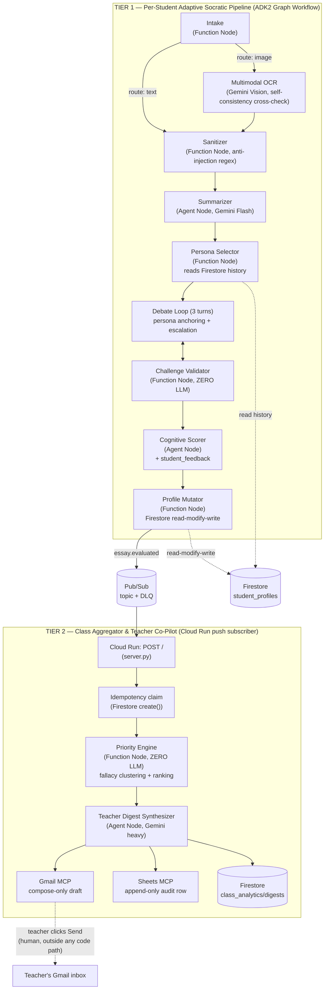

# eduagent — Collaborative Partner Socratic Mentor

> All Things Agentic Hackathon — Track: **Collaborative Partner**
> Philosophy: *using AI to teach students not to depend on AI.*

`eduagent` is a two-tier agentic system built on **Google ADK2 + Gemini (Vertex AI) + Firestore + Pub/Sub + Cloud Run**:

- **Tier 1 (per-student):** a student submits an essay (typed text, a photo of a handwritten one, or a Google Doc share link) and gets challenged by an adversarial Socratic debate persona instead of being handed answers or corrections.
  - **Autonomous Persona Routing:** Diagnoses reasoning weaknesses across 4 dimensions (Evidence, Counterarguments, Logical Consistency, Scope/Generalization) and routes to the matching persona (`The Skeptic`, `The Devil's Advocate`, `The Nitpicker`, `The Expander`) with an explainable routing badge + practice selector.
  - **Full 3-Turn Socratic Debate:** Deep interactive questioning without premature termination.
  - **Cognitive Radar Chart:** Interactive 2D SVG spider/radar polygon chart visualizing scores across 4 reasoning axes (Logical Coherence, Evidence Quality, Scope Awareness, Counterargument Handling).
  - **Metacognitive Self-Correction Loop:** Allows students to submit a revised thesis addressing the diagnosed weaknesses with instant feedback.
- **Tier 2 (class-wide):** every graded essay triggers an event-driven Class Aggregator that clusters shared logical fallacies across a class, ranks which students need attention first (deterministically, not by LLM vibes), and drafts a digest for the teacher — who is the only one who can actually send it.
  - **Dynamic Integrations:** Live Google Sheet audit logging (with URL auto-parsing, smart multi-tab fallback, and a `🧪 Test Sheet Connection` button) and automated Gmail draft synthesis.

---

### 🚀 Try It Out Live (Instant Demo)

You can experience the fully deployed system immediately without any local setup:
* **Live Web App:** [https://eduagent-class-aggregator-636767063018.asia-southeast1.run.app/](https://eduagent-class-aggregator-636767063018.asia-southeast1.run.app/)
* **Demo Login Credentials:**
  * **Student Portal:** Student ID: `c1_stu01` | Password: `demo123`
  * **Teacher Portal:** Teacher ID: `c1_teacher` | Password: `demo123`


---

## 1. Mandatory disclosure

This architecture is inspired by the author's personal prior project, **CritiqAI** (entered in a different, earlier competition). **All code in this repository was written from scratch during this hackathon's Submission Period.** No source file, prompt, or data schema was copied from that prior project — it was used only as a case study for lessons learned (see `PROJECT_WIKI.md` section 9). Track: **Collaborative Partner**.

---

## 2. Architecture



**Data flow in one sentence:** an essay (text or photo) goes through a deterministic-first ADK2 graph that debates, scores, and mutates a per-student Firestore profile; every graded essay fires a Pub/Sub event that a separate Cloud Run service picks up to compute a class-wide priority ranking and draft a teacher digest — with exactly one human-in-the-loop gate (the teacher pressing Send in their own Gmail).

### Repo layout

```
src/eduagent/
  nodes/          Tier 1 graph nodes (intake, ocr, summarizer, persona_selector, debate, validator, scorer, mutator)
  skills/         personas.py, debate_escalation.py, language.py — reusable logic, not graph nodes
  memory/         student_profile.py (pure merge logic) + firestore_memory.py (Firestore wrapper)
  aggregator/     Tier 2: priority_engine.py (zero-LLM ranking), digest.py, digest_store.py, idempotency.py, class_aggregator.py
  integrations/   gmail_mcp.py (compose-only), sheets_mcp.py (append-only)
  graph/          tier1_pipeline.py — the ADK2 Workflow wiring
  server.py       Cloud Run entrypoint (Tier 2 Pub/Sub push subscriber)
  llm.py          thin Vertex AI wrapper (text/JSON/multimodal, retry + degrade)
  resilience.py   shared retry policy for Firestore/Pub/Sub/Gmail/Sheets
  interactive.py  turn-by-turn debate helper for a future Web UI/API
scripts/          one-off verification, demo, seed, deploy-adjacent, and diagnostic scripts (see PROJECT_WIKI.md / TODO.md for what each does)
eval/             ADK Eval Suite (evalset.py, results/) + eval/test_images/ (real handwritten essay photos)
tests/            pytest suite — fast unit tests by default, `@pytest.mark.e2e` for the one real-Vertex-AI test
```

---

## 3. Spin-up instructions (from a clean machine)

### 3.1 Prerequisites

- Python 3.11+ (developed against 3.14)
- A GCP project with these APIs enabled: `aiplatform`, `firestore`, `run`, `pubsub`, `cloudtrace`, `logging`, `gmail.googleapis.com`
- A Firestore database (Native mode) in that project
- `gcloud` CLI authenticated, or a service-account key with the roles listed in section 5 below
- (Optional, for Tier 2 delivery channels) a Gmail OAuth Desktop client + a Google Sheet

### 3.2 Install

```bash
git clone <this-repo-url>
cd CritiqAI_ver2
python -m venv .venv && source .venv/bin/activate   # or .venv\Scripts\activate on Windows
pip install -r requirements.txt
cp .env.example .env   # then fill in GCP_PROJECT_ID and the other values
```

`GOOGLE_APPLICATION_CREDENTIALS` in `.env` should point at a service-account key with the roles in section 5 — or omit it entirely and use `gcloud auth application-default login` for local dev.

### 3.3 Verify GCP connectivity before touching the pipeline

```bash
python scripts/doctor.py
```

This checks GCP ADC, Firestore, Pub/Sub topic/DLQ/subscription, the Gmail OAuth token, the Sheets audit spreadsheet, and Vertex AI reachability in one shot — exactly what you want to run before a live demo recording, and the fastest way to find out what's missing on a fresh machine.

### 3.4 Run the fast test suite (no live GCP calls)

```bash
pytest tests/ -q -m "not e2e"
```

Add `-m e2e` (or drop the marker filter) to also run the one test that hits real Vertex AI (`tests/test_tier1_skeleton.py`).

### 3.5 Run Tier 1 for real (text)

```bash
python scripts/demo_tier1_run.py
```

Runs 3 essays for the same (freshly created) student through the real graph against real Vertex AI + Firestore, and prints how persona choice and `score_trend` evolve across essays — the direct evidence for "becomes more helpful over time."

### 3.6 Run Tier 1 with a real handwritten photo (Multimodal OCR)

```bash
python scripts/demo_ocr_run.py                    # 3 real photos -> full pipeline
python scripts/demo_real_handwriting_ocr.py        # OCR node only, all 12 sample photos in eval/test_images/
```

### 3.7 Seed sample class data + run Tier 2 locally

```bash
python scripts/seed_student_profiles.py                       # 5 sample student_profiles documents
python scripts/run_class_aggregator_subscriber.py --once       # pulls essay.evaluated events, runs process_event()
```

Deploy `firestore.indexes.json` once (needed for `GET /api/classes/{class_id}/students`, a class-roster query filtered by `class_id` and ordered by `flags.last_updated` -- Firestore rejects that exact filter+order_by combo without the matching composite index rather than silently full-scanning):

```bash
gcloud firestore indexes composite create --collection-group=student_profiles \
  --field-config field-path=class_id,order=ascending \
  --field-config field-path=flags.last_updated,order=descending
# or: firebase deploy --only firestore:indexes   (if this project also uses the Firebase CLI)
```

### 3.8 Run the ADK Eval Suite

```bash
python scripts/run_eval_suite.py
```

Writes `eval/results/eval_report.{json,md}` — see section 6 for the last committed results.

### 3.9 Run the Cloud Run service locally

```bash
PYTHONPATH=src uvicorn eduagent.server:app --host 0.0.0.0 --port 8080
curl localhost:8080/health-check   # -> {"status": "ok"}
```

### 3.10 Deploy to Cloud Run

```bash
gcloud run deploy eduagent-class-aggregator \
  --source . \
  --region <your-region> \
  --service-account eduagent-sa@<project>.iam.gserviceaccount.com \
  --no-allow-unauthenticated \
  --max-instances=5 \
  --concurrency=80 \
  --min-instances=0 \
  --set-env-vars GCP_PROJECT_ID=<project>,GOOGLE_GENAI_USE_VERTEXAI=True

# Then point the class-aggregator-sub subscription at the deployed URL as a
# push subscription with OIDC auth instead of pulling:
gcloud pubsub subscriptions update class-aggregator-sub \
  --push-endpoint=<deployed-service-url>/ \
  --push-auth-service-account=eduagent-sa@<project>.iam.gserviceaccount.com \
  --push-auth-token-audience=<deployed-service-url>
```

**Verified on the real project (ĐỢT 8):** the above two commands were run against the live deployment, then a real test event was published to `essay-evaluated` and confirmed in Cloud Run logs to be picked up and processed by `process_event()` with no pull-mode script running anywhere — i.e. the Pub/Sub → Cloud Run push path in the architecture diagram above is not just deployed, it fires end-to-end.

This project's live deployment (below) is deployed with `--allow-unauthenticated`, so that a judge can open the Web UI without a GCP identity or an OAuth flow. That means Cloud Run IAM does **not** protect the `POST /` Pub/Sub push endpoint — the application itself verifies the push subscription's OIDC token (see ADR-014, `server.py::_verify_pubsub_push_auth`) so `/` still cannot be triggered by an arbitrary unauthenticated caller. If you redeploy this service and do **not** need a public demo UI, prefer `--no-allow-unauthenticated` plus Pub/Sub's own service-agent OIDC token as the sole gate instead — that is the simpler, IAM-only setup and needs no application-layer check.

If you do keep `--allow-unauthenticated` (as this project's live deployment does), also set two extra env vars so `_verify_pubsub_push_auth` can pin the expected caller identity/audience, not just check that *some* valid Google-signed token was presented:

```bash
gcloud run deploy eduagent-class-aggregator \
  --source . \
  --region <your-region> \
  --service-account eduagent-sa@<project>.iam.gserviceaccount.com \
  --allow-unauthenticated \
  --max-instances=5 \
  --concurrency=80 \
  --min-instances=0 \
  --set-env-vars GCP_PROJECT_ID=<project>,GOOGLE_GENAI_USE_VERTEXAI=True,PUBSUB_PUSH_AUDIENCE=<the deployed service URL>,PUBSUB_PUSH_SERVICE_ACCOUNT=<push-subscription-invoker>@<project>.iam.gserviceaccount.com
```

`--max-instances=5`/`--concurrency=80`/`--min-instances=0` (ĐỢT 3 GCP cost hygiene): scale-to-zero when idle, and a hard ceiling so an unexpected traffic spike (or a bug causing retry storms) can't silently burn through hackathon credits by autoscaling unbounded — matches the "make your credits last" guidance in the hackathon rules. These are flags on the deploy command itself; changing them on the already-live service requires re-running `gcloud run deploy` (or `gcloud run services update`) with intent, which this repo does not do automatically.

**Live deployment (this project):** `https://eduagent-class-aggregator-636767063018.asia-southeast1.run.app` (region `asia-southeast1`, same region as Firestore). Verified against the real service:

```bash
curl https://eduagent-class-aggregator-636767063018.asia-southeast1.run.app/health-check
# -> {"status":"ok"}
```

See ADR-011 for a real deploy-time finding: the endpoint is `/health-check`, not the more conventional `/healthz`.

### 3.11 GCP cost/credit protection (budget alert + teardown)

Before leaving this project running unattended for any length of time:

1. **Budget alert:** Console → Billing → Budgets & alerts → Create budget, scope it to this project, set a threshold (e.g. 50%/90%/100% of your hackathon credit grant) with email notifications. This project's actual spend is dominated by Vertex AI calls (Flash-tier, cheap) and Cloud Run (scale-to-zero per §3.10) — Firestore/Pub/Sub/Cloud Trace stay within free-tier at this project's volume.
2. **Artifact Registry cleanup policy** (optional, complements `scripts/cleanup_gcp_artifacts.py`'s on-demand sweep with an always-on one enforced by the registry itself): `gcloud artifacts repositories set-cleanup-policies cloud-run-source-deploy --location=<your-region> --policy=cleanup-policy.json`, where `cleanup-policy.json` keeps the 3 most recent versions and deletes untagged versions older than 7 days. Not applied automatically here — it's a live change to infrastructure already in use, left for you to run deliberately once you've confirmed the retention window you want.
3. **Teardown after judging ends** (irreversible — only run once you're certain the submission window is closed): `gcloud run services delete eduagent-class-aggregator --region <region>`, delete the Pub/Sub topics/subscriptions (`essay-evaluated`, `essay-evaluated-dlq`, `class-aggregator-sub`), and delete the `eduagent-sa` service account key/service account once no longer needed. Firestore data (student profiles, digests) has no ongoing cost at rest for this project's volume, so it's safe to leave for post-submission reference.

---

## 4. Architecture Decision Records

| # | Decision | Reason | Rejected alternative |
|---|---|---|---|
| ADR-001 | Gmail least-privilege is enforced at the **code layer** (never call `.send()`), not the OAuth scope layer. A hard AST-based test (`tests/test_gmail_mcp_never_sends.py`) gates this. | Real testing (2026-08-24) proved `gmail.compose` does **not** block `messages.send()` — Google's own docs describe it as including send. No Gmail scope exists that permits draft creation but blocks send at the credential layer. | Assuming OAuth scope alone would provide the HITL guarantee (the original plan) — proven false by live testing before it could surface in a demo or judge Q&A. |
| ADR-002 | Use `gemini-3.5-flash` (default) and `gemini-3.7-flash` (`heavy_model`) instead of `gemini-3.5-pro`. | `gemini-3.5-pro` does not exist as a publisher model in this project/region (verified via `client.models.list()`) — only the Flash lineage (3.5/3.6/3.7) is available. `heavy_model` still satisfies "Gemini 3.5 or newer" since 3.7 > 3.5. | Blocking on a Pro-tier model that isn't actually available in this environment. |
| ADR-003 | Pub/Sub `max_delivery_attempts = 5` (not 3). | Google Pub/Sub enforces a platform floor of 5 for dead-letter policies — a subscription create with 3 was rejected outright. This is a platform constraint, not a design choice. | Sticking to the original plan's "3 tries then DLQ" framing, which isn't achievable on this platform. |
| ADR-004 | Bilingual (VI/EN) output applies only to the **expression layer** (debate questions, `student_feedback`), never to `summarizer.fallacies_draft`. | `persona_selector` matches personas to weaknesses via English-keyword regex on `fallacies_draft`. Translating fallacy labels to Vietnamese would silently break persona selection (wrong persona chosen, no exception raised) — a bug that would be very hard to notice by eyeballing a demo. | Translating every LLM output field uniformly "for consistency." |
| ADR-005 | `interactive.py`'s turn-by-turn debate session state lives in an **in-process dict**, not Firestore. | Matches the Session-vs-Memory boundary established in Phase 2: an in-flight debate turn is Session state (fine to lose on a process restart); the finished transcript is what gets persisted, via the existing `profile_mutator` → Firestore path. | Persisting every in-flight turn to Firestore "to be safe" — unnecessary writes for state that's legitimately ephemeral. **Known follow-up**: if this ever runs behind multiple Cloud Run instances, this store needs to move to Redis or Firestore-with-TTL before a session can survive routing to a different instance. |
| ADR-006 | The ADK Eval Suite (`eval/evalset.py` + `scripts/run_eval_suite.py`) uses hand-written deterministic scoring, not `google.adk.evaluation`'s LLM-as-judge framework. | Grading this system's own LLM output with another LLM call is exactly the reward-hacking risk the hackathon's own guidance warns about. Answer-leak/prompt-injection cases re-run the real production validator/sanitizer directly; persona-fidelity cases score real model output against a fixed keyword lexicon via plain string matching — no LLM ever judges another LLM's output here. | Using `rubric_based_evaluator`/`llm_as_judge` out of the box for a faster-to-write suite. |
| ADR-007 | Multimodal OCR runs Gemini Vision **twice** per image and cross-checks the two transcriptions with `difflib`, downgrading confidence to `low` on disagreement regardless of what either call self-reports. | A real blurred test image caused Gemini Vision to self-report `confidence: "high"` while transcribing **completely unrelated, fabricated content** in 2 of 4 manual trials — prompt-only anti-hallucination instructions were not sufficient alone. The cross-check caught the failure 3/3 times after being added. | Trusting the model's single self-reported `confidence` field, or hand-tuning an image-blur heuristic threshold (rejected: no real photo dataset to calibrate a threshold against, high overfitting risk). |
| ADR-008 | Low-confidence OCR output is routed to `pending_essays` (reusing the Phase 4 mechanism for `scores_degraded`), never written into `student_profiles`. | Content Gemini itself is not confident about should never silently become part of a student's permanent, teacher-visible record — same principle as never writing a fabricated score on an LLM outage. | Writing the essay through with a visible-but-ignored confidence flag — too easy for a Web UI/teacher review step to miss. |
| ADR-009 | Multimodal (image) Vertex AI calls use a 60s timeout, not the 30s used for text-only JSON calls. | A real ~2.6MB test photo hit `504 DEADLINE_EXCEEDED` at 30s despite being perfectly legible — image payloads genuinely take longer to process than text prompts. | Keeping one shared timeout constant "for simplicity" — verified wrong against a real (not synthetic) photo. |
| ADR-010 | Digest history documents use `digest_id = event_id` (the triggering Pub/Sub event's id), not a freshly generated UUID. | Reuses the idempotency guarantee already established for `processed_events` (Phase 3) — a redelivered event overwrites the same digest document instead of creating a duplicate history entry. | Minting a new UUID per digest write, which would require a separate dedup mechanism for the history collection. |
| ADR-011 | The Cloud Run health-check endpoint is named `/health-check`, not the more conventional `/healthz`. | Real deploy testing on this project found that the exact literal path `/healthz` gets intercepted and answered with a generic Google-branded 404 by Cloud Run's underlying Knative/Istio infrastructure *before* the request ever reaches the container or even the IAM auth check — confirmed by testing every other path variant (`/healthz/` with a trailing slash, `/HEALTHZ`, and several unrelated nonexistent paths), all of which correctly reached the app/IAM layer. | Assuming `/healthz` is always safe because it's a common convention elsewhere (Kubernetes, many other PaaS) — proven wrong specifically on Cloud Run's serving stack via live testing, not documentation. |
| ADR-012 | Enforce layered prompt-injection sanitization and strict input size bounds at the REST API boundary (`src/eduagent/api.py`), not only inside the ADK graph workflow. | Live web entries (`POST /api/debate/start`, `/start-with-image`, `/start-with-gdoc`, `/turn`) bypass the batch graph runtime to maintain interactive latency. Sanitizing at the API boundary guarantees that every prompt constructed for Vertex AI is cleaned of instruction-override attempts and bounded in size (max 20k chars essay, 4k chars reply, 10MB image), preventing cost-DoS and 504 gateway timeouts. | Relying solely on the ADK Graph's `intake` node to sanitize, which left live interactive HTTP sessions unprotected. |
| ADR-013 | Issue stateless, HMAC-signed scoped access tokens at `/api/auth/login` to prevent Insecure Direct Object References (IDOR) across classes. | All teacher and student analytics endpoints (`/api/classes/{class_id}/*`) require a valid Bearer token and verify that the token's authorized `class_id` matches the path, preventing unauthorized cross-class PII exposure while maintaining zero external identity provider dependencies for hackathon judging. | Trusting client-supplied `class_id` headers or leaving class API paths unverified. |
| ADR-014 | Verify the Pub/Sub push subscription's OIDC token in the application layer (`server.py::_verify_pubsub_push_auth`, using `google.oauth2.id_token.verify_oauth2_token`) instead of relying solely on Cloud Run IAM to gate `POST /`. | Live testing (ĐỢT 8) found the deployed service uses `--allow-unauthenticated` (needed so judges can open the Web UI without a GCP identity) — `curl`-ing `POST /` directly returned `500` (a real internal error from malformed input), proving the request reached the container **unauthenticated**. Cloud Run IAM was not protecting this endpoint at all; a prior README draft claimed otherwise before this was caught. | Assuming `--no-allow-unauthenticated` was in effect because that was the original plan — not verified against the actually-deployed service until this review. |

(ADR-001 through ADR-003 were captured live in `TODO.md` during Phase 0/3; ADR-004 onward were captured during the "Cải tiến Đợt 2" and Phase 5/6 work; ADR-012 & ADR-013 were added during Phase 7/ĐỢT 6; ADR-014 was added during ĐỢT 8 — see `TODO.md` and `PROJECT_WIKI.md` section 12 for the full narrative and verification evidence behind each one.)

---

## 5. Security model

- **Service account (`eduagent-sa`)**: exactly 5 roles, no Owner/Editor — `datastore.user`, `pubsub.editor`, `aiplatform.user`, `cloudtrace.agent`, `logging.logWriter`.
- **Gmail**: OAuth scope `gmail.compose` only; **the codebase itself never calls `.send()`** anywhere in the digest flow (see ADR-001) — enforced by an AST-based test (`tests/test_gmail_mcp_never_sends.py`), not just code review discipline. The actual HITL gate is the teacher clicking Send in their own Gmail client, a human action entirely outside this system's code path.
- **Sheets**: `append_audit_row()` is the only exported write — no update/delete, so the audit trail can't be quietly edited by a bug or a future feature.
- **Cloud Run**: this project's live deployment uses `--allow-unauthenticated` (so a judge can open the Web UI directly), which means Cloud Run IAM does not gate `POST /`. Instead, `server.py::_verify_pubsub_push_auth` verifies the Pub/Sub push subscription's OIDC token in the application layer using `google.oauth2.id_token.verify_oauth2_token` (real signature verification against Google's public keys, not a shared secret) before `process_event()` ever runs — see ADR-014. A redeploy that doesn't need a public UI should prefer `--no-allow-unauthenticated` instead, which needs no application-layer check.
- **Authentication & Authorization**: `auth.py` provides a lightweight, stateless role-based authentication model with a shared demo password (`demo123`) designed specifically for streamlined hackathon judging without external IdP dependencies. Scoped HMAC-signed session tokens enforce multi-tenant isolation, ensuring a logged-in user in class `c1` cannot inspect or modify rosters/digests in other classes (IDOR prevention, see ADR-013).
- **Layered Prompt-Injection Defense**: Regex sanitization (`strip_injection_attempts`) executes at both the HTTP API boundary (`api.py`) and the ADK workflow graph (`intake.py`), ensuring that essays, OCR outputs, GDocs, and turn-by-turn student replies are stripped of instruction-override attempts before LLM prompt construction.
- **Input Boundaries & Cost-DoS Protection**: Strict upper bounds are enforced on all ingress vectors (max 20,000 chars for essays, max 4,000 chars for debate replies, max 10MB for base64 handwriting images, max 100KB for Google Doc fetches).
- **XSS & Output Hygiene**: The Web UI uses contextual HTML escaping (`esc()`), strict `textContent` DOM node population, and event delegation to prevent stored XSS attacks across student submissions and teacher dashboards.
- **Validator independence**: `nodes/validator.py` never imports `eduagent.llm` — verified by reading the module, not just by convention — so the same LLM call that generates a debate question can never also be the one judging it.
- **Secrets**: `.env`, `secrets/`, `*-key.json`, `*service-account*.json`, `client_secret_*.json` are all gitignored; `git log --all` was scanned for API-key/private-key patterns and old-repo filenames before every phase checkpoint (see `TODO.md` Phase 0/7) — clean.

---

## 6. ADK Eval Suite results

Last run (see `eval/results/eval_report.md` / `.json` for the full machine-readable report, committed to this repo):

| Group | Passed | Total | Pass rate |
|---|---|---|---|
| answer_leak | 6 | 6 | 100% |
| prompt_injection | 5 | 5 | 100% |
| persona_fidelity | 4 | 4 | 100% |
| **Overall** | **15** | **15** | **100%** |

Every metric is deterministic (re-runs the real validator/sanitizer, or does plain keyword matching on real model output) — see ADR-006 for why this suite deliberately does not use an LLM-as-judge.

---

## 7. Multimodal ingestion evidence

`eval/test_images/` contains 12 real handwritten essay photos (neat, messy with cross-outs, cursive, pencil, tilted, low-light/faded, bullet-point notes) used to validate `nodes/ocr.py` end-to-end. Last real run against Vertex AI: 9 `confidence=high`, 1 `medium` (correctly the one with visible cross-outs), 2 `low` (correctly the two hardest-to-parse bullet-point note images) — matching a human's own judgment of each photo's legibility. See `scripts/demo_real_handwriting_ocr.py` to reproduce.
