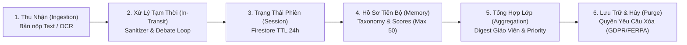

# Student Data Lifecycle & Privacy Threat Model

> **Core Commitment:** EduAgent được thiết kế theo nguyên tắc **Privacy by Design**, tham chiếu các tiêu chuẩn bảo vệ dữ liệu giáo dục (FERPA & COPPA) làm kim chỉ nam thiết kế, đảm bảo dữ liệu học sinh không bị dùng để huấn luyện mô hình thương mại và có kiểm soát phân quyền chống rò rỉ chéo giữa các lớp học.
>
> **Lưu ý minh bạch:** Đây là các cân nhắc kiến trúc theo hướng privacy-by-design, KHÔNG phải chứng nhận pháp lý tuân thủ FERPA/COPPA — dự án prototype hackathon này chưa qua rà soát pháp lý/compliance chính thức.

---

## 1. Vòng Đời Dữ Liệu Học Sinh (Student Data Lifecycle)

| Giai Đoạn | Loại Dữ Liệu | Nơi Lưu Trữ | Vòng Đời (Retention Policy) | Biện Pháp Bảo Mật |
|---|---|---|---|---|
| **1. Ingestion** | Ảnh chụp bài viết tay, text gốc | RAM / Temp Buffer | Giải phóng ngay sau khi trích xuất | Không lưu trữ ảnh raw trên đĩa |
| **2. In-Transit** | Prompt tranh biện, token | Google Cloud Run RAM | Tồn tại trong thời gian request (<10s) | Mã hóa in-transit qua hạ tầng TLS quản lý bởi Google Cloud |
| **3. Session** | Lượt tranh luận 1-3 | `debate_sessions/{id}` | Tự động xóa sau 24h (TTL policy) | Truy cập định danh qua `session_id` |
| **4. Profile Memory** | Điểm số 4 trục, danh mục điểm yếu | `student_profiles/{id}` | Bounded tối đa 50 bài gần nhất | Phân vùng cách ly theo `class_id` |
| **5. Class Analytics** | Xếp hạng ưu tiên, giáo án 15p | `class_digests/{class_id}` | 90 ngày (1 học kỳ) | Chỉ giáo viên có token hợp lệ mới đọc được |
| **6. Archival / Deletion** | Toàn bộ dữ liệu định danh | N/A | Xóa vĩnh viễn theo yêu cầu (Right-to-be-Forgotten) | Hỗ trợ xóa theo lô qua Admin API |

---

## 2. Ma Trận Phân Loại Dữ Liệu (Data Classification Matrix)

| Cấp Độ Bảo Mật | Trường Dữ Liệu | Mục Đích Sử Dụng | Nguyên Tắc Kiểm Soát |
|---|---|---|---|
| 🔴 **PII (Thông tin định danh)** | `name`, `student_id`, `class_id` | Định danh học sinh trong danh sách lớp | Không gửi kèm trong prompt LLM ngoại trừ định danh nội bộ |
| 🟡 **Cognitive Metadata** | Điểm 4 trục, chuỗi persona, lỗi ngụy biện | Tính toán Priority Index & thích ứng Socratic | Dữ liệu dạng số và danh mục chuẩn hóa, không nhạy cảm |
| 🟢 **Pedagogical Digest** | Tóm tắt lớp học, kế hoạch bài giảng 15p | Hỗ trợ giáo viên can thiệp nhóm | Tổng hợp phi định danh hoặc nhóm học sinh trong cùng lớp |

---

## 3. Mô Hình Đe Dọa An Ninh (STRIDE Threat Model)

| Mối Đe Dọa (Threat) | Kịch Bản Tấn Công (Attack Vector) | Giải Pháp Phòng Ngự Của EduAgent (Mitigation Architecture) |
|---|---|---|
| **S - Spoofing** *(Giả mạo danh tính)* | Kẻ xấu giả mạo học sinh hoặc giáo viên để gửi bài/đọc điểm | Token HMAC-SHA256 (`auth.py`), payload gắn chặt `user_id`/`class_id`/`role` + `exp`. Khoá ký **bắt buộc** đến từ Secret Manager khi deploy: `auth.py::_resolve_session_secret()` khiến tiến trình **từ chối khởi động** nếu phát hiện đang chạy trên Cloud Run (`K_SERVICE`) mà `EDUAGENT_SESSION_SECRET` vẫn là giá trị demo đã commit, hoặc ngắn hơn 32 ký tự. Xem ADR-016. |
| **T - Tampering** *(Chỉnh sửa dữ liệu)* | Học sinh A ghi đè hồ sơ / điểm của học sinh B qua API | Chấm điểm độc lập ở Node Scorer phía server + xếp hạng tất định; **và** `server.py::_verify_student_auth()` buộc token `role=student` chỉ được nộp cho đúng `user_id` của mình (`/api/debate/{start,start-with-image,start-with-gdoc,turn,reflect}`). Với `/turn` — payload chỉ có `session_id` — quyền sở hữu được suy ra từ `student_id`/`class_id` lưu trong chính session, không từ request. Xem ADR-018.  **ĐỢT 15 (ADR-022):** `/reflect` cũng đã chuyển sang payload chỉ có `session_id` + `revised_claim`. Trước đó nó nhận `student_id`/`class_id`/`original_claim`/`original_fallacy` trực tiếp từ client mà không gắn với phiên tranh biện nào — ADR-018 chặn được việc học sinh A bơm điểm cho học sinh B, nhưng **không chặn việc tự bơm điểm `growth_bonus`/`breakthrough_count` cho chính mình** bằng một vòng lặp `curl`, không cần bài luận nào. Nay mọi trường đều đọc từ session trên server, và mỗi phiên đã hoàn thành chỉ được reflect **đúng một lần** (`interactive.claim_reflection()`, cờ `has_reflected` ghi **trước** khi gọi LLM). |
| **R - Repudiation** *(Phủ nhận hành động)* | Học sinh phủ nhận đã nộp bài luận hoặc tham gia tranh luận | Ghi nhận Idempotency Event ID, Timestamp ISO UTC và Trace ID cho mỗi lượt tương tác. |
| **I - Information Disclosure** *(Rò rỉ thông tin)* | Học sinh lớp A đọc trộm hồ sơ điểm số hoặc bài của lớp B (IDOR) | RBAC Token Scoping: mọi route `/api/classes/*` và mọi hành động của học sinh đều kiểm `token.class_id == target.class_id`. Ngoài ra `/api/debate/turn` và `/api/debate/reflect` xác thực token **trước** khi tra session, để người gọi giấu tên không phân biệt được `session_id` thật (403) với `session_id` bịa (404). |
| **D - Denial of Service** *(Tấn công từ chối dịch vụ)* | Vòng lặp `curl` vào endpoint public làm cạn ngân sách Vertex AI (cost-DoS) | Giới hạn cứng 3 lượt tranh biện (`VALIDATOR.max_debate_turns`); **token bucket rate limiting theo IP** (`src/eduagent/rate_limit.py`: 10 burst / 1 request mỗi 5 giây cho endpoint tranh biện; 5 burst / 1 mỗi 10 giây cho `/api/auth/login`), trả `429` kèm `Retry-After`; cap kích thước input (ĐỢT 6). **Giới hạn phải nói rõ:** state của bucket là **per-process**, nên trần thực tế là `N_instances × capacity` — nó chặn lạm dụng thông thường và ràng buộc chi phí, KHÔNG phải rate limiter phân tán; bản production thật cần Cloud Armor / API Gateway đứng trước. Xem ADR-017. |
| **E - Elevation of Privilege** *(Leo thang đặc quyền)* | Học sinh chuyển role thành teacher để xem bảng điều khiển | `role` nằm trong payload đã được HMAC ký nên không sửa được mà không có khoá; các route giáo viên kiểm `required_role="teacher"` tại tầng route. |

> **Ghi chú trung thực (ĐỢT 14 — Information Disclosure, tầng deployment):** một review ngoài phát hiện `scripts/deploy_to_cloud_run.py` nhồi **refresh token OAuth của Gmail và Sheets** vào `--env-vars-file`. Kiểm tra service live xác nhận đúng: `gcloud run services describe` in ra **nguyên văn cả 2 token**. Cloud Run lưu env var thường trong revision spec ở dạng **cleartext**, nên bất kỳ ai có quyền `run.services.get` (một quyền **đọc**, được cấp rộng hơn nhiều so với `secretmanager.versions.access`) đều đọc được. Đã sửa (ADR-020): cả 3 credential mount từ **Secret Manager** qua `--update-secrets`, revision spec chỉ còn con trỏ `valueFrom.secretKeyRef`. Có **hard gate AST** (`tests/test_deploy_never_inlines_secrets.py`) và **check trong `doctor.py`** để không tái diễn. ⚠️ Vì 2 token này đã từng bị phơi ra, nên **rotate** chúng (chạy lại auth flow) chứ không chỉ chuyển chỗ lưu.
>
> **Ghi chú trung thực (ĐỢT 12):** trước ĐỢT 12, hai dòng của bảng này mô tả biện pháp **không tồn tại trong code**. Dòng D khẳng định có "Token bucket rate limiting" trong khi `grep -rniE "rate.?limit|token.?bucket|slowapi|throttl" src/` cho 0 kết quả; và dòng S/T dựa vào một khoá HMAC mà thực tế deploy chưa bao giờ set, tức service live đang ký token bằng **chuỗi mặc định công khai trong repo** — bất kỳ ai đọc repo đều tự ký được token `role=teacher` cho lớp bất kỳ. Cả hai đã được **implement thật** (không phải xoá claim) và có test bảo vệ tại `tests/test_student_endpoint_auth.py`.

---

## 4. Privacy & Regulatory Considerations (Cân Nhắc Bảo Mật & Pháp Lý — KHÔNG phải Compliance Declaration)

1. **Không sử dụng dữ liệu học sinh để huấn luyện:** EduAgent sử dụng Google Vertex AI / Gemini Enterprise API với cấu hình **Zero Data Retention** cho mục đích huấn luyện mô hình nền tảng.
2. **Không quảng cáo & không bán dữ liệu:** 100% dữ liệu chỉ phục vụ mục đích sư phạm nội bộ nhà trường.
3. **Quyền riêng tư minh bạch:** Giáo viên và phụ huynh có thể kiểm tra bảng phân tích lý do can thiệp bất kỳ lúc nào.
4. **Ranh giới trung thực:** Mục này mô tả các cân nhắc thiết kế (privacy-by-design), không phải một chứng nhận tuân thủ pháp lý FERPA/COPPA chính thức — điều đó đòi hỏi rà soát pháp lý ngoài phạm vi kiến trúc kỹ thuật của một dự án hackathon.
