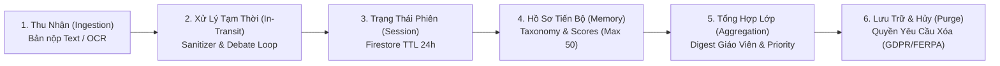

# Student Data Lifecycle & Privacy Threat Model

> **Core Commitment:** eduagent được thiết kế theo nguyên tắc **Privacy by Design**, tham chiếu các tiêu chuẩn bảo vệ dữ liệu giáo dục (FERPA & COPPA) làm kim chỉ nam thiết kế, đảm bảo dữ liệu học sinh không bị dùng để huấn luyện mô hình thương mại và có kiểm soát phân quyền chống rò rỉ chéo giữa các lớp học.
>
> **Lưu ý minh bạch:** Đây là các cân nhắc kiến trúc theo hướng privacy-by-design, KHÔNG phải chứng nhận pháp lý tuân thủ FERPA/COPPA — dự án prototype hackathon này chưa qua rà soát pháp lý/compliance chính thức.

---

## 1. Vòng Đời Dữ Liệu Học Sinh (Student Data Lifecycle)

| Giai Đoạn | Loại Dữ Liệu | Nơi Lưu Trữ | Vòng Đời (Retention Policy) | Biện Pháp Bảo Mật |
|---|---|---|---|---|
| **1. Ingestion** | Ảnh chụp bài viết tay, text gốc | RAM / Temp Buffer | Giải phóng ngay sau khi trích xuất | Không lưu trữ ảnh raw trên đĩa |
| **2. In-Transit** | Prompt tranh biện, token | Google Cloud Run RAM | Tồn tại trong thời gian request (<10s) | Mã hóa in-transit qua hạ tầng TLS quản lý bởi Google Cloud |
| **3. Session** | Lượt tranh luận 1-3 | `debate_sessions/{id}` | Tự động xóa sau 24h (TTL policy) | Truy cập định danh qua `session_id` |
| **4. Profile Memory** | Điểm số 4 trục, danh mục điểm yếu | `student_profiles/{id}` | Bounded tối đa 50 bài gần nhất | Phân vùng cách ly theo `class_id` |
| **5. Class Analytics** | Xếp hạng ưu tiên, giáo án 15p | `class_digests/{class_id}` | 90 ngày (1 học kỳ) | Chỉ giáo viên có token hợp lệ mới đọc được |
| **6. Archival / Deletion** | Toàn bộ dữ liệu định danh | N/A | Xóa vĩnh viễn theo yêu cầu (Right-to-be-Forgotten) | Hỗ trợ xóa theo lô qua Admin API |

---

## 2. Ma Trận Phân Loại Dữ Liệu (Data Classification Matrix)

| Cấp Độ Bảo Mật | Trường Dữ Liệu | Mục Đích Sử Dụng | Nguyên Tắc Kiểm Soát |
|---|---|---|---|
| 🔴 **PII (Thông tin định danh)** | `name`, `student_id`, `class_id` | Định danh học sinh trong danh sách lớp | Không gửi kèm trong prompt LLM ngoại trừ định danh nội bộ |
| 🟡 **Cognitive Metadata** | Điểm 4 trục, chuỗi persona, lỗi ngụy biện | Tính toán Priority Index & thích ứng Socratic | Dữ liệu dạng số và danh mục chuẩn hóa, không nhạy cảm |
| 🟢 **Pedagogical Digest** | Tóm tắt lớp học, kế hoạch bài giảng 15p | Hỗ trợ giáo viên can thiệp nhóm | Tổng hợp phi định danh hoặc nhóm học sinh trong cùng lớp |

---

## 3. Mô Hình Đe Dọa An Ninh (STRIDE Threat Model)

| Mối Đe Dọa (Threat) | Kịch Bản Tấn Công (Attack Vector) | Giải Pháp Phòng Ngự Của eduagent (Mitigation Architecture) |
|---|---|---|
| **S - Spoofing** *(Giả mạo danh tính)* | Kẻ xấu giả mạo học sinh hoặc giáo viên để gửi bài/đọc điểm | Token HMAC có chữ ký bí mật (`_SESSION_SECRET`), gắn chặt với `class_id` và `role`. |
| **T - Tampering** *(Chỉnh sửa dữ liệu)* | Học sinh cố can thiệp API để sửa điểm số hoặc bỏ qua kiểm duyệt | Chấm điểm độc lập từ Node Scorer phía Server; thuật toán xếp hạng hoàn toàn tất định. |
| **R - Repudiation** *(Phủ nhận hành động)* | Học sinh phủ nhận đã nộp bài luận hoặc tham gia tranh luận | Ghi nhận Idempotency Event ID, Timestamp ISO UTC và Trace ID cho mỗi lượt tương tác. |
| **I - Information Disclosure** *(Rò rỉ thông tin)* | Học sinh lớp A đọc trộm hồ sơ điểm số hoặc bài của lớp B (IDOR) | RBAC Token Scoping: Mọi truy vấn Firestore đều kiểm tra `token.class_id == target.class_id`. |
| **D - Denial of Service** *(Tấn công từ chối dịch vụ)* | Gửi hàng ngàn câu hỏi để làm cạn kiệt ngân sách Gemini | Giới hạn cứng 3 lượt tranh luận (Hard Cap); Token bucket rate limiting; In-memory cache. |
| **E - Elevation of Privilege** *(Leo thang đặc quyền)* | Học sinh chuyển role thành teacher để xem bảng điều khiển | Xác thực phân quyền nghiêm ngặt tại middleware FastAPI (`role == "teacher"`). |

---

## 4. Privacy & Regulatory Considerations (Cân Nhắc Bảo Mật & Pháp Lý — KHÔNG phải Compliance Declaration)

1. **Không sử dụng dữ liệu học sinh để huấn luyện:** eduagent sử dụng Google Vertex AI / Gemini Enterprise API với cấu hình **Zero Data Retention** cho mục đích huấn luyện mô hình nền tảng.
2. **Không quảng cáo & không bán dữ liệu:** 100% dữ liệu chỉ phục vụ mục đích sư phạm nội bộ nhà trường.
3. **Quyền riêng tư minh bạch:** Giáo viên và phụ huynh có thể kiểm tra bảng phân tích lý do can thiệp bất kỳ lúc nào.
4. **Ranh giới trung thực:** Mục này mô tả các cân nhắc thiết kế (privacy-by-design), không phải một chứng nhận tuân thủ pháp lý FERPA/COPPA chính thức — điều đó đòi hỏi rà soát pháp lý ngoài phạm vi kiến trúc kỹ thuật của một dự án hackathon.
