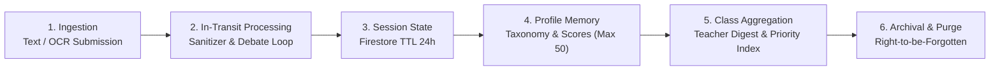

# Student Data Lifecycle & Privacy Threat Model

> **Core Commitment:** `EduAgent` is built following **Privacy by Design** principles, referencing educational data protection frameworks (such as FERPA & COPPA) as architectural north stars. Student data is never used to train foundation models, and multi-tenant isolation prevents cross-class data leakage.
>
> **Transparency Disclaimer:** These represent architectural privacy-by-design considerations, NOT formal legal compliance certifications for FERPA/COPPA.

---

## 1. Student Data Lifecycle

| Phase | Data Type | Storage Location | Retention Policy | Security Measures |
|---|---|---|---|---|
| **1. Ingestion** | Handwritten essay photo, raw text | RAM / Temp Buffer | Released immediately upon extraction | No persistent raw image storage on disk |
| **2. In-Transit** | Debate prompts, token streams | Google Cloud Run RAM | Request duration only (<10s) | TLS in-transit encryption managed by Google Cloud |
| **3. Session** | Debate turns 1–3 | `debate_sessions/{id}` | Automated 24h purge (TTL policy) | Scoped access strictly via `session_id` |
| **4. Profile Memory** | 4-axis cognitive scores, fallacy tags | `student_profiles/{id}` | Bounded to 50 most recent essays | Strict multi-tenant isolation by `class_id` |
| **5. Class Analytics** | Priority rankings, 15m mini-lesson | `class_digests/{class_id}` | 90 days (one semester) | Accessible solely by authorized teacher tokens |
| **6. Archival / Deletion** | All student identifiers & records | N/A | Hard deletion upon request (Right-to-be-Forgotten) | Batch deletion supported via administrative endpoints |

---

## 2. Data Classification Matrix

| Security Level | Data Fields | Operational Purpose | Access & Processing Controls |
|---|---|---|---|
| 🔴 **PII (Personally Identifiable Information)** | `name`, `student_id`, `class_id` | Student roster identification | Never forwarded in raw LLM prompts; scoped to local auth headers |
| 🟡 **Cognitive Metadata** | 4-axis scores, persona history, fallacy tags | Priority Index calculation & Socratic adaptation | Normalized categorical & numerical metrics, non-sensitive |
| 🟢 **Pedagogical Digest** | Class summary, 15m lesson plan | Teacher small-group intervention | Aggregated class-level data or anonymized student clusters |

---

## 3. STRIDE Security & Threat Model

| Threat | Attack Vector | EduAgent Defense Architecture |
|---|---|---|
| **S - Spoofing** *(Identity Spoofing)* | Malicious actor impersonates a student or teacher to submit essays or read scores | HMAC-SHA256 tokens (`auth.py`) binding `user_id`, `class_id`, `role`, and `exp`. Signing secret **must** be supplied from Secret Manager in production: `auth.py::_resolve_session_secret()` causes the process to **fail boot** if running on Cloud Run (`K_SERVICE`) with a missing or default key (ADR-016). **Audit Wave 16 (ADR-025):** ADR-016 closed token *forgery*; it did not close token *issuance*. `/api/auth/login` issued a `role=teacher` token for any `class_id` to anyone presenting the shared demo passcode — and that passcode is printed in the README, so the end state for an attacker was identical. Teacher login now honours a separate `EDUAGENT_TEACHER_PASSWORD` when configured; when it is not, `scripts/doctor.py` reports a WARN so the tradeoff is visible rather than implied. |
| **T - Tampering** *(Data Tampering)* | Student A overwrites records/scores of Student B via API | Server-side scoring at the Scorer node + deterministic ranking; `server.py::_verify_student_auth()` enforces that `role=student` tokens can only submit for their own `user_id` (`/api/debate/{start,start-with-image,start-with-gdoc,turn,reflect}`). For `/turn` & `/reflect`, ownership is resolved from the session record itself (ADR-018). **Audit Wave 15 (ADR-022):** `/reflect` has migrated to a minimal payload containing only `session_id` and `revised_claim`. Previously, it accepted `student_id`, `class_id`, `original_claim`, and `original_fallacy` directly from the client without checking for a valid active debate session. While ADR-018 blocked cross-student profile writes, it did **not** prevent a student from self-farming `growth_bonus` / `breakthrough_count` via a loop of `curl` requests with arbitrary inputs. Now, all historical fields are resolved server-side from the session document, and each completed session is restricted to **exactly one** Socratic reflection submission (`interactive.claim_reflection()`, writing the `has_reflected` flag **prior** to the LLM call). **Audit Wave 16 (ADR-024):** that flag write was a read-then-write, so two concurrent POSTs on two Cloud Run instances could both observe `has_reflected=False` and both bank a bonus — the claim of blocking race conditions overstated what the code did (same class of error as ADR-015). The check and the write now happen inside a single Firestore transaction (`firestore_session.claim_reflection_atomically()`), covered by a two-thread regression test. |
| **R - Repudiation** *(Action Repudiation)* | Student claims they never submitted an essay or participated in debate | Every turn logs an Idempotent Event ID, ISO UTC Timestamp, and OpenTelemetry Trace ID. |
| **I - Information Disclosure** *(Information Leakage)* | Student in Class A inspects scores or submissions from Class B (IDOR) | Scoped RBAC tokens: all `/api/classes/*` endpoints verify `token.class_id == target.class_id`. `/api/debate/turn` and `/api/debate/reflect` validate authorization **prior** to session lookup to prevent timing/existence oracle attacks. |
| **D - Denial of Service** *(Resource Exhaustion)* | `curl` loop on public endpoints exhausts Vertex AI quotas (cost-DoS) | Hard cap of 3 debate turns (`VALIDATOR.max_debate_turns`); **per-IP token-bucket rate limiting** (`rate_limit.py`: burst 10 / 1 req per 5s for debate; burst 5 / 1 per 10s for login) returning `429` + `Retry-After`. **Audit Wave 17 (ADR-026):** the key came from the FIRST `X-Forwarded-For` entry, which Cloud Run lets the caller set — measured on the live service, 8/8 requests with random spoofed headers bypassed a drained bucket. The key is now the **last** hop, the only one the proxy vouches for; re-measured after the fix, 8/8 spoofed requests are refused; strict payload size caps. **Audit Wave 16:** `/api/parent-note` also invokes Gemini (`draft_parent_note()`) and scans every profile in the class first, but carried no bucket — it is now rate-limited on the same limiter. Per-process buckets bound cost; production environments place Cloud Armor / API Gateway in front (ADR-017). |
| **E - Elevation of Privilege** *(Privilege Escalation)* | Student elevates role to teacher to inspect class dashboards | Role claim is protected within the HMAC-signed token; all teacher routes strictly require `required_role="teacher"` at the routing layer. |

> **Audit Note (Audit Wave 14 — Credential Storage):** An audit identified OAuth refresh tokens in plain environment variables. This was resolved (ADR-020): all 3 secrets are mounted from **Secret Manager** via `--update-secrets`, leaving only `valueFrom.secretKeyRef` pointers in the revision spec. An AST test (`tests/test_deploy_never_inlines_secrets.py`) and a check in `doctor.py` enforce this regression gate.
>
> **Audit Note (Audit Wave 12 — Threat Model Alignment):** Rate limiting and strict HMAC verification were fully implemented and validated with automated regression suites in `tests/test_student_endpoint_auth.py`.

---

## 4. Privacy & Regulatory Considerations

1. **Zero Foundation Model Training:** `EduAgent` utilizes Google Cloud Vertex AI / Gemini Enterprise APIs configured with **Zero Data Retention** policies for model training.
2. **No Advertising or Monetization:** 100% of processed data is strictly used for school instructional workflows.
3. **Auditable Pedagogical Logic:** Teachers and administrators can inspect the reasoning and fallacy rules behind any intervention recommendation at any time.
4. **Design Boundaries:** This document details architectural privacy-by-design measures rather than formal statutory certifications.
