# Google Cloud Trace Evidence: End-to-End Distributed Telemetry

> **Observability Architecture:** Toàn bộ luồng xử lý từ lúc học sinh gửi bài luận đến khi tổng hợp báo cáo lớp học được gắn nhãn phân tán qua OpenTelemetry, xuất trực tiếp sang **Google Cloud Trace & Cloud Logging**.
>
> ⚠️ **Minh bạch về nguồn dữ liệu (ĐỢT 11 claim audit):** Toàn bộ span/thứ tự/attribute dưới đây được sinh bởi `scripts/export_trace_evidence.py::simulate_traced_pipeline()` — script này gọi `time.sleep(0.015)`, `time.sleep(0.045)`, v.v. cho từng node thay vì gọi Gemini/Firestore thật, để **minh hoạ đúng cấu trúc phân cấp span** (root → intake → sanitizer → summarizer → persona → debate → scorer → aggregator) mà code production thật sự tạo ra (`src/eduagent/tracing.py`, decorator `@traced_node` áp trên 8 node thật). **Các con số mili-giây dưới đây KHÔNG phải latency thực đo qua Gemini API** (một lượt gọi Gemini Flash thật thường mất 0.5–3 giây, không thể 45ms hay 124ms cho 3 lượt debate). Coi bảng/gantt này là **bằng chứng cấu trúc instrumentation hoạt động đúng**, không phải benchmark hiệu năng. Muốn có số latency thật: chạy 1 essay qua Cloud Run live và đọc trực tiếp từ Cloud Trace Console (xem `docs/gcp_evidence_checklist.md`).

---

## 1. Biểu Đồ Phân Cấp Span (Trace Span Hierarchy — thứ tự thật, số ms là giá trị mô phỏng minh hoạ)

```mermaid
gantt
    title Trace Span Hierarchy (illustrative structure — NOT measured latency, see caveat above)
    dateFormat X
    axisFormat %s ms
    section Root Pipeline
    eduagent.pipeline.essay_evaluation : 0, 250
    section Ingestion & Security
    eduagent.node.intake : 0, 15
    eduagent.node.sanitizer : 15, 24
    section Cognitive Reasoning
    eduagent.node.summarizer : 24, 69
    eduagent.node.persona_selector : 69, 74
    section Socratic Debate
    eduagent.node.debate_loop (3 turns) : 74, 198
    section Teacher Synthesis
    eduagent.node.scorer : 199, 220
    eduagent.node.class_aggregator : 220, 250
```



---

## 2. Bảng Thứ Tự & Thuộc Tính Từng Node (Span Attribute Details)

> Cột "Latency" dưới đây là giá trị `time.sleep()` mô phỏng trong script minh hoạ, KHÔNG phải độ trễ Gemini/Firestore thật — xem cảnh báo minh bạch ở đầu tài liệu.

| Span Name | Simulated Latency (không phải số thật) | Status | Key OpenTelemetry Attributes |
|---|:---:|:---:|---|
| `eduagent.node.intake` | ~15 ms (mô phỏng) | `OK` | `input_type=text`, `text_length=342` |
| `eduagent.node.sanitizer` | ~9 ms (mô phỏng) | `OK` | `injection_detected=False` |
| `eduagent.node.summarizer` | ~46 ms (mô phỏng) | `OK` | `claims_count=3`, `fallacies_count=2` |
| `eduagent.node.persona_selector` | ~5 ms (mô phỏng) | `OK` | `persona_selected=skeptic` |
| `eduagent.node.debate_loop (3 turns)` | ~124 ms (mô phỏng) | `OK` | `turns=3`, `persona=skeptic` |
| `eduagent.node.scorer` | ~21 ms (mô phỏng) | `OK` | `avg_score=7.25` |
| `eduagent.node.class_aggregator` | ~31 ms (mô phỏng) | `OK` | `students_ranked=12`, `mini_lesson_generated=True` |

* **Điều thật sự được chứng minh ở đây:** thứ tự thực thi span đúng theo pipeline thật, span cha-con lồng nhau đúng (debate loop có 3 span con cho 3 turn), và attribute mỗi span khớp đúng dữ liệu node đó sinh ra trong code thật.
* **Điều KHÔNG được claim:** tổng thời gian xử lý thật của 1 essay qua Gemini là ~250ms — con số này chỉ đúng trong môi trường mô phỏng `time.sleep()`.
* **Trace Standard:** W3C Trace Context (`traceparent` header propagation) — cơ chế propagation này là thật, độc lập với việc số ms trong file này là mô phỏng hay không.

---

## 3. Nhật Ký Truy Vết Tích Hợp (Structured Cloud Logging Integration)

Mọi log entry trong Cloud Run tự động liên kết với Trace ID thông qua trường `logging.googleapis.com/trace`:
```json
{
  "severity": "INFO",
  "message": "Class aggregation completed. 12 students ranked, 1 systemic fallacy identified.",
  "logging.googleapis.com/trace": "projects/eduagent-hackathon/traces/4bf92f3577b34da6a3ce929d0e0e4736",
  "logging.googleapis.com/spanId": "span_aggregator_01",
  "eduagent": {
    "class_id": "c1",
    "students_ranked": 12,
    "mini_lesson": "15-Minute Workshop: Deconstructing Unsupported Claims"
  }
}
```
